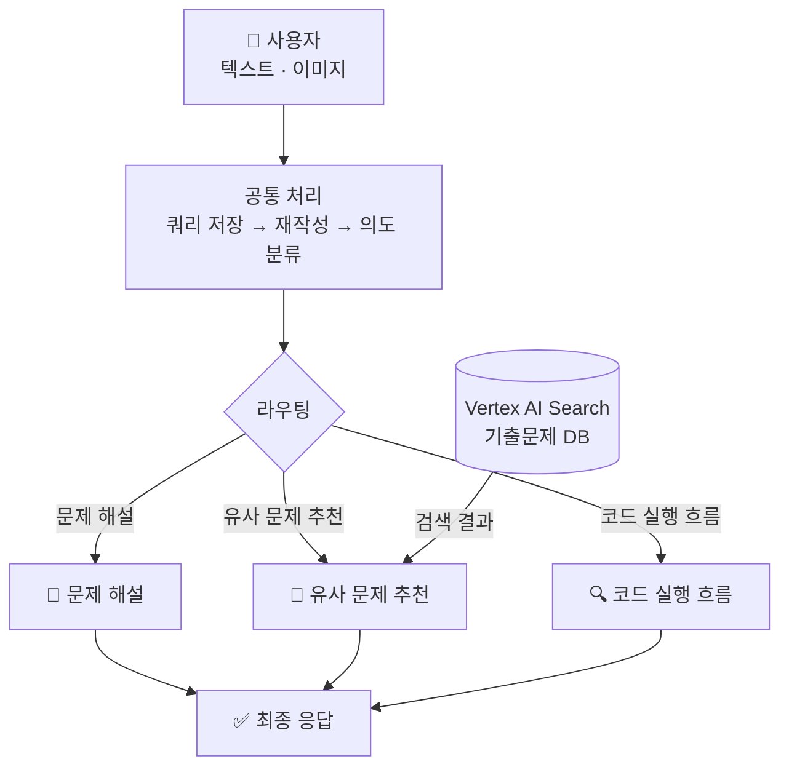
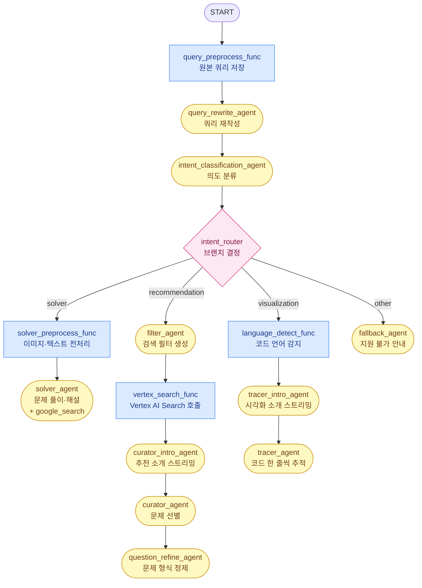

# 정보처리기사 실기 학습을 위한 지능형 플랫폼

## 목차
- [동기](#동기)
- [사용 기술 및 도구](#사용-기술-및-도구)
- [전체 흐름](#전체-흐름)
- [크롤링](#크롤링)
- [임베딩 전략](#임베딩-전략)
- [Vertex AI Search 적재 / 검색](#vertex-ai-search-적재--검색)
- [Google ADK 에이전트 프로세스](#google-adk-에이전트-프로세스)
- [FastAPI 래핑](#fastapi-래핑)
- [스트리밍 데이터 전송 흐름](#스트리밍-데이터-전송-흐름)

---

## 동기

- **주제별 문제 탐색의 어려움**  
  특정 개념(예: C 언어 이중 포인터, 자바 업캐스팅)에 특화된 문제 연습의 한계. 기존 기출·복원 자료가 시험 회차 단위로 구성되어 있어 주제별 탐색이 번거로움 (RAG 기반 벡터 검색 적용 계획)

- **복잡한 코드 실행 흐름 추적의 한계**  
  자바의 상속·업캐스팅이나 C의 포인터·재귀 등 복잡한 제어 흐름 및 메모리 변화를 텍스트만으로 파악하기 어려움. 단계별 디버깅 방식의 시각화(Tracer) 기능을 통한 이해도 제고

---

## 사용 기술 및 도구

### Google ADK (Agent Development Kit) `v2.0`

Google ADK 기반의 에이전트 오케스트레이션 전반 구현

| 기능 | 사용 위치 | 설명 |
|------|-----------|------|
| **`Workflow`** | `agent.py` | 전체 에이전트 그래프 정의. 엣지(edge) 목록으로 노드 간 실행 순서·분기를 선언 |
| **`Agent` (LlmAgent)** | `llm_agents/` 전반 | Gemini 모델을 래핑하는 LLM 에이전트. `instruction`, `output_schema`, `output_key` 등 설정 |
| **`Event`** | `nodes/` 전반 | 노드(전처리 함수)가 세션 상태를 갱신·반환할 때 사용하는 이벤트 타입 |
| **`App`** | `runner/workflow_runner.py` | 에이전트 애플리케이션 컨테이너. `context_cache_config`·`events_compaction_config`를 설정하고 `InMemoryRunner`에 전달 |
| **`ContextCacheConfig`** | `runner/workflow_runner.py` | 컨텍스트 캐싱 설정. 대형 시스템 프롬프트를 Gemini API 캐시로 재사용해 LLM 호출 비용 절감 (`min_tokens`, `ttl_seconds`, `cache_intervals`) |
| **`EventsCompactionConfig`** | `runner/workflow_runner.py` | 이벤트 컴팩션 설정. 장기 세션의 이전 이벤트 기록을 LLM으로 요약·압축해 컨텍스트 윈도우 절약. 슬라이딩 윈도우(`compaction_interval`, `overlap_size`)와 토큰 임계값(`token_threshold`, `event_retention_size`) 두 전략을 병행 |
| **`InMemoryRunner`** | `runner/workflow_runner.py` | 워크플로우 실행 러너. 세션·아티팩트 서비스를 내장 |
| **`RunConfig` + `StreamingMode.SSE`** | `runner/workflow_runner.py` | SSE(Server-Sent Events) 방식의 스트리밍 응답 설정 |
| **`session_service`** | `runner/workflow_runner.py` | 세션 생성·조회. `state` 딕셔너리로 노드 간 데이터 공유 |
| **Artifact Service** | `artifacts/image.py` | 이미지 업로드 처리 시 아티팩트로 저장·참조 |
| **`CallbackContext` (after_agent_callback)** | `callbacks/` | 에이전트 실행 완료 후 후처리(스트리밍 메시지 생성 등) |
| **`google_search` (built-in tool)** | `solver_agent.py` | 문제 해설 시 Google 검색을 ADK 기본 도구로 활용 |
| **`output_schema`** | `llm_agents/` 전반 | Pydantic 스키마를 통한 구조화된 LLM 출력 강제 |

### 그 외 기술 스택

| 분류 | 기술 |
|------|------|
| **API 서버** | FastAPI · Uvicorn |
| **LLM** | Google Gemini |
| **벡터 검색 (RAG)** | Vertex AI Search |
| **크롤링** | BeautifulSoup4 · urllib |

---

## 전체 흐름



---

## 크롤링

### 출처

티스토리 블로그 **[chobopark.tistory.com](https://chobopark.tistory.com)** — 정보처리기사 실기 기출·복원 문제 회차별 정리 사이트.  
2020년~2025년 총 19개 회차 URL 코드 명시 및 데이터 수집.

### 사용 라이브러리

| 라이브러리 | 역할 |
|---|---|
| `urllib.request` | HTTP GET 요청 (표준 라이브러리, 별도 설치 불필요) |
| `BeautifulSoup4` + `lxml` | HTML 파싱 및 DOM 탐색 |

### 크롤링 전략

Tistory 포스트 구조 분석 기반 데이터 추출 규칙.

| 항목 | 추출 방법 |
|---|---|
| **문제 본문** | `tt_article_useless_p_margin` 컨테이너 내 h3 이후 노드를 순차 탐색 |
| **정답 / 해설 분리** | Tistory `moreLess` 내 텍스트 색상으로 구분 — 청록(`#009a87`) → 정답(`answer`), 파랑(`#006dd7`) → 해설(`explanation`) |
| **코드 블록** | `colorscripter-code-table` 클래스 및 배경색 기반 소스코드 추출 |
| **이미지** | 문제 본문의 이미지(`images`) 및 답안 블록 내 이미지(`answer_images`) 수집 |
| **과부하 방지** | 요청 간 1.5초 딜레이 |

### 출력 형식

문항 1개 = JSONL 1줄 (`data/정보처리기사_실기_기출문제.jsonl`)

```json
{
  "id": "2024_01_05",
  "year": 2024,
  "round": 1,
  "exam_title": "2024년 1회 정보처리기사 실기 기출문제 복원",
  "question_number": 5,
  "question": "다음 Java 소스코드의 실행 결과를 쓰시오.\n\npublic class Test {\n  public static void main(String[] args) {\n    System.out.print(\"Result: \" + (10 + 20));\n  }\n}",
  "images": [],
  "answer": "Result: 30",
  "answer_images": [],
  "explanation": "",
  "source_url": "https://chobopark.tistory.com/476",
  "crawled_at": "2026-04-23T15:46:46Z"
}
```

## 임베딩 전략

크롤링 결과(`정보처리기사_실기_기출문제.jsonl`)를 Vertex AI Search 적재용 문서로 가공 (`vertexai_search/build_vertexai_datastore.py`)

### 기본 원칙

**시험 1문항당 1건의 문서 구성**.  
이미지로 제공된 문항의 경우 이번 프로젝트에서는 제외함 (추후 OCR 도입 시 개선 가능)

### content 필드 구성

벡터 검색 핵심 필드인 `content`를 문제·정답·해설 구역 레이블로 통합하여 단일 텍스트로 구성.

```text
[문제] 다음 Java 소스코드의 실행 결과를 쓰시오.

public class Test {
  public static void main(String[] args) {
    System.out.print("Result: " + (10 + 20));
  }
}
[정답] Result: 30
[해설] 정수 10과 20을 더한 값(30)을 문자열과 결합하여 출력하는 기본적인 Java 프로그래밍 문항임.
```

이와 같은 구성으로 답변 확인형 검색과 주제 기반 문제 검색 모두 동일 문서에서 히트 가능.


## Vertex AI Search 적재 / 검색

### 적재 (Upload)

`vertexai_search/upload_vertexai_datastore.py`

임베딩 전략 단계에서 생성한 `vector_store_vertexai.jsonl`을 Discovery Engine REST API를 통해 문서 단위 업로드.

**API 흐름**

| 단계 | HTTP | 엔드포인트 |
|---|---|---|
| 신규 생성 | `POST` | `.../branches/{branch}/documents?documentId={id}` |

**요청 바디 예시**

```json
{
  "structData": {
    "year": 2024,
    "round": 1,
    "question_type": "java",
    "question_category": "code",
    "code_language": "java"
  },
  "content": {
    "mimeType": "text/plain",
    "rawBytes": "<base64 인코딩된 [문제]/[정답]/[해설] 텍스트>"
  }
}
```

---

### 검색 (Search)

`vertexai_search/search_vertexai.py`

유사 문제 추천 시 에이전트 내부 호출. 의미 기반(semantic) 검색 및 메타데이터 필터 병행 적용.

**API 엔드포인트**

```
POST https://discoveryengine.googleapis.com/v1alpha/
  projects/{PROJECT}/locations/{LOCATION}/collections/default_collection/
  engines/{ENGINE_ID}/servingConfigs/default_search:search
```

**요청 페이로드 예시**

```json
{
  "query": "Java 업캐스팅 관련 문제 찾아줘",
  "pageSize": 10,
  "filter": "year >= 2022 AND question_type: ANY(\"java\")",
  "relevanceFilterSpec": {
    "keywordSearchThreshold": {"relevanceThreshold": "HIGH"},
    "semanticSearchThreshold": {"semanticRelevanceThreshold": 0.7}
  },
  "contentSearchSpec": {"searchResultMode": "CHUNKS"}
}
```

**메타데이터 필터 옵션 (`VertexExamSearchMetadata`)**

| 필드 | 타입 | 설명 | 예시 |
|---|---|---|---|
| `years` | `tuple[int]` | 특정 연도만 검색 | `(2023, 2024)` |
| `year_min` / `year_max` | `int` | 연도 범위 | `year_min=2022` |
| `rounds` | `tuple[int]` | 특정 회차 | `(1, 2)` |
| `question_types` | `tuple[str]` | 문제 유형 | `("java", "concept")` |


## Google ADK 에이전트 프로세스

### 전체 워크플로우 구조

`agent.py`에서 `Workflow` 엣지 목록으로 전체 그래프를 선언.

> **범례** 
> 🟦 Function Node (Python 함수) 
> 🟨 LLM Agent (Gemini 호출)



---

### 세션 & State

`InMemoryRunner` 기반 세션 관리 및 노드 간 데이터 공유를 위한 `state` 딕셔너리 활용.  
LLM Agent의 `output_key` 기반 결과 자동 저장 및 Function Node의 직접적인 state 입출력.

| state 키 | 저장 주체 | 내용 |
|---|---|---|
| `has_image` | 세션 초기화 | 이미지 첨부 여부 |
| `original_query` | `query_preprocess_func` | 원본 사용자 입력 |
| `intent_output` | `intent_classification_agent` | 분류된 의도 |
| `vertex_filter_output` | `filter_agent` | Vertex AI 검색 조건 |
| `solver_output` | `solver_agent` | 문제 풀이 결과 |
| `curator_output` | `curator_agent` | 선별된 문제 목록 |
| `refine_output` | `question_refine_agent` | 정제된 문제 카드 |
| `problem_cards` | `build_curation_callback` | 최종 추천 카드 |
| `tracer_output` | `tracer_agent` | 코드 추적 결과 |

---

### Artifact (이미지)

이미지 업로드 시 두 가지 경로로 처리.

1. `artifact_service.save_artifact()` — 세션에 이미지 바이너리 저장 (`uploaded_image.jpg`)
2. `types.Part(inline_data=...)` — Content에 직접 포함해 `solver_agent`가 멀티모달로 참조

```python
await runner.artifact_service.save_artifact(
    app_name=..., user_id=..., session_id=...,
    filename="uploaded_image.jpg",
    artifact=types.Part.from_bytes(data=image_bytes, mime_type=mime_type),
)
```

---

### App & Runner

`App`의 `root_agent` 래핑 및 `InMemoryRunner` 기반 실행 담당.

```python
_app = App(name=root_agent.name, root_agent=root_agent, ...)
workflow_runner = InMemoryRunner(app=_app)
```

세션 생성 → Content 구성 → `run_async()` 호출 순으로 동작.  
`run_async()`를 통한 이벤트 스트림 반환.

---

### 스트리밍 (SSE)

`RunConfig(streaming_mode=StreamingMode.SSE)` 기반 LLM 응답 토큰 단위 스트리밍.  
`curator_intro_agent`·`tracer_intro_agent`를 통한 스트리밍 전용 소개 메시지 출력 활용.

---

### 비용 최적화

**ContextCacheConfig** — 대형 시스템 프롬프트를 Gemini API 캐시로 재사용해 입력 토큰 비용 절감

| 설정 | 값 | 의미 |
|---|---|---|
| `min_tokens` | 2048 | 이 토큰 수 이상일 때만 캐시 적용 |
| `ttl_seconds` | 600 | 캐시 유효 시간 (10분) |
| `cache_intervals` | 5 | 5회 호출마다 캐시 갱신 |

**EventsCompactionConfig** — 장기 세션의 이벤트 기록을 LLM으로 요약·압축해 컨텍스트 윈도우 절약

| 설정 | 값 | 의미 |
|---|---|---|
| `compaction_interval` | 5 | 5회 invocation마다 슬라이딩 윈도우 컴팩션 |
| `token_threshold` | 8000 | 누적 토큰 8K 초과 시 즉시 컴팩션 |
| `event_retention_size` | 10 | 마지막 10개 이벤트는 원문 유지 |

## FastAPI 래핑

`api/app.py` — ADK 워크플로우의 HTTP API 노출.

### 엔드포인트

| 메서드 | 경로 | 설명 |
|---|---|---|
| `POST` | `/chat` | 비스트리밍 — 전체 결과를 JSON으로 한 번에 반환 |
| `POST` | `/chat/stream` | SSE 스트리밍 — 텍스트를 실시간 전송 |
| `GET` | `/health` | 서버 상태 확인 |

**요청 형식** (`multipart/form-data`)

| 필드 | 타입 | 설명 |
|---|---|---|
| `query` | `string` | 사용자 질문 텍스트 |
| `image` | `file` (선택) | 첨부 이미지 (jpeg/png/webp/gif) |

---

### 응답 타입

라우팅 결과에 따른 `/chat` 및 `/chat/stream`의 `type` 필드 가변적 적용.

**`type: "text"`** — 문제 해설·fallback

```json
{ "type": "text", "route": "solver", "response": "..." }
```

**`type: "curation"`** — 유사 문제 추천 카드

```json
{ "type": "curation", "route": "recommendation", "title": "맞춤 추천 문제 카드", "problemCards": [...] }
```

**`type: "tracer"`** — 코드 실행 흐름 시각화

```json
{ "type": "tracer", "route": "visualization", "data": {...} }
```

---

### SSE 이벤트 구조 (`/chat/stream`)

| `type` | 설명 |
|---|---|
| `state` | 현재 처리 중인 노드 이름 |
| `chunk` | 텍스트 스트리밍 조각 (solver·intro·fallback 노드만) |
| `curation` | 추천 문제 카드 완성 데이터 |
| `tracer` | 코드 추적 완성 데이터 |
| `done` | 완료 신호 |
| `error` | 오류 메시지 |

```
data: {"type": "state", "node": "solver_agent"}
data: {"type": "chunk", "text": "풀이: "}
data: {"type": "chunk", "text": "변수 a에 ..."}
data: {"type": "done"}
```

## 스트리밍 데이터 전송 흐름

`/chat/stream` 요청 시 ADK와 FastAPI 간 협력 방식 설명.

### ADK 측 — `StreamingMode.SSE`

`execute_agent_stream()`을 통한 `RunConfig(streaming_mode=StreamingMode.SSE)` 적용 및 `run_async()` 호출.  
ADK 기반 LLM 토큰 생성 즉시 `event.partial = True` 이벤트 반환.  
이벤트별 `event.content.parts[].text`(텍스트 조각) 및 `event.node_info.name`(현재 노드 이름) 포함.

```python
# runner/workflow_runner.py
async for event in workflow_runner.run_async(
    ...,
    run_config=RunConfig(streaming_mode=StreamingMode.SSE),
):
    yield event   # partial 이벤트 포함
```

### FastAPI 측 — `StreamingResponse`

`StreamingResponse(event_generator(), media_type="text/event-stream")` 기반 async generator의 SSE 형식(`data: ...\n\n`) 클라이언트 푸시.

`event_generator` 내부 처리 흐름:

```
ADK event 수신
  ├─ 새 노드 진입 → {"type": "state", "node": "..."}  전송  (모든 노드)
  └─ partial 텍스트
       ├─ 스트리밍 허용 노드 → {"type": "chunk", "text": "..."}  전송
       └─ 그 외 노드 → 무시 (state에만 저장됨)

모든 이벤트 소진 후 (워크플로우 완료)
  ├─ state["problem_cards"] 있음 → {"type": "curation", ...}  전송
  ├─ state["tracer_output"] 있음 → {"type": "tracer", ...}  전송
  └─ {"type": "done"}  전송
```

### 스트리밍 허용 노드 (`_STREAM_NODES`)

일부 LLM Agent 대상 토큰 스트리밍 제한.  
사용자 불필요 정보(분류·필터링 등) 노출 방지를 위한 특정 4개 노드 출력 기반 `chunk` 전송.

| 노드 | 역할 |
|---|---|
| `solver_agent` | 문제 풀이·해설 본문 |
| `tracer_intro_agent` | 코드 추적 시작 전 소개 메시지 |
| `curator_intro_agent` | 유사 문제 추천 시작 전 소개 메시지 |
| `fallback_agent` | 지원 불가 안내 메시지 |

> `curator_intro_agent`·`tracer_intro_agent` 존재 이유:  
> `curator_agent`·`tracer_agent`의 JSON 스키마 출력(`output_schema`) 강제에 따른 자연어 스트리밍 불가  
> intro 에이전트 기반 선제적 소개 메시지 스트리밍 후 후속 LLM 작업 실행

---