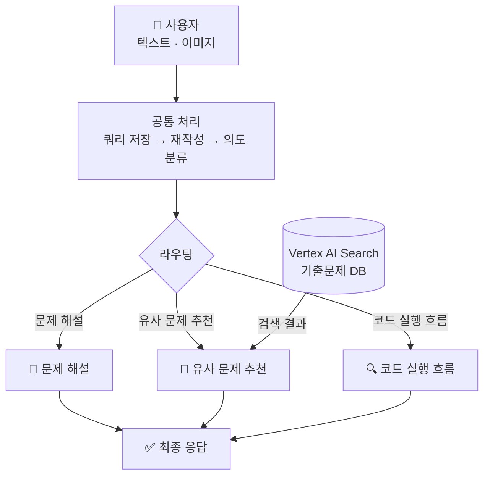
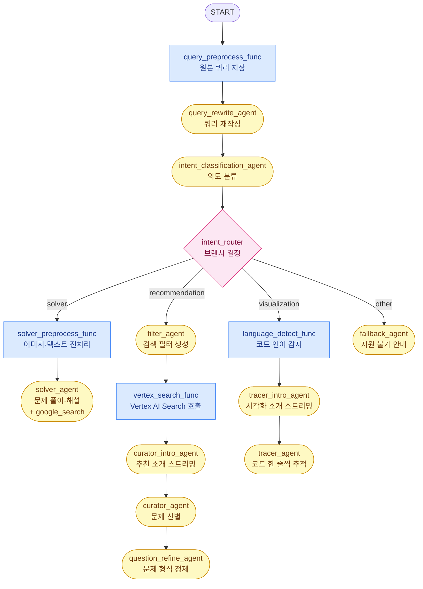

# 정보처리기사 실기 학습을 위한 지능형 플랫폼

## 목차
- [동기](#동기)
- [사용 기술 및 도구](#사용-기술-및-도구)
- [전체 흐름](#전체-흐름)
- [크롤링](#크롤링)
- [임베딩 전략](#임베딩-전략)
- [Vertex AI Search 적재 / 검색](#vertex-ai-search-적재--검색)
- [Google ADK 에이전트 프로세스](#google-adk-에이전트-프로세스)
- [FastAPI 래핑](#fastapi-래핑)
- [스트리밍 데이터 전송 흐름](#스트리밍-데이터-전송-흐름)

---

## 동기

- **주제별 문제 탐색의 어려움**  
  특정 개념(예: C 언어 이중 포인터, 자바 업캐스팅)에 특화된 문제 연습의 한계. 기존 기출·복원 자료의 회차별 구성에 따른 주제별 탐색 번거로움 해소를 위해 RAG 기반 벡터 검색 적용.

- **복잡한 코드 실행 흐름 추적의 한계**  
  자바의 상속·업캐스팅이나 C의 포인터·재귀 등 복잡한 제어 흐름 및 메모리 변화 파악의 어려움. 단계별 디버깅 방식의 시각화(Tracer) 기능을 통한 이해도 제고.

---

## 사용 기술 및 도구

### Google ADK (Agent Development Kit) `v2.0`

Google ADK 기반의 에이전트 오케스트레이션 전반 구현.

| 기능 | 사용 위치 | 설명 |
|------|-----------|------|
| **`Workflow`** | `agent.py` | 전체 에이전트 그래프 정의. 엣지(edge) 목록을 통한 노드 간 실행 순서·분기 선언. |
| **`Agent` (LlmAgent)** | `llm_agents/` 전반 | Gemini 모델 래핑 LLM 에이전트. `instruction`, `output_schema`, `output_key` 등 설정 관리. |
| **`Event`** | `nodes/` 전반 | 노드(전처리 함수)의 세션 상태 갱신 및 반환용 이벤트 타입. |
| **`App`** | `runner/workflow_runner.py` | 에이전트 애플리케이션 컨테이너. `context_cache_config` 및 `events_compaction_config` 설정 후 `InMemoryRunner` 전달. |
| **`ContextCacheConfig`** | `runner/workflow_runner.py` | 컨텍스트 캐싱 설정. 대형 시스템 프롬프트의 Gemini API 캐시 재사용을 통한 비용 절감 (`min_tokens`, `ttl_seconds`, `cache_intervals`). |
| **`EventsCompactionConfig`** | `runner/workflow_runner.py` | 이벤트 컴팩션 설정. 장기 세션 기록의 LLM 요약·압축을 통한 컨텍스트 윈도우 절약. 슬라이딩 윈도우 및 토큰 임계값 전략 병행. |
| **`InMemoryRunner`** | `runner/workflow_runner.py` | 워크플로우 실행 러너. 세션 및 아티팩트 서비스 내장. |
| **`RunConfig` + `StreamingMode.SSE`** | `runner/workflow_runner.py` | SSE(Server-Sent Events) 방식의 스트리밍 응답 설정. |
| **`session_service`** | `runner/workflow_runner.py` | 세션 생성·조회 및 `state` 딕셔너리를 통한 노드 간 데이터 공유 관리. |
| **Artifact Service** | `artifacts/image.py` | 이미지 업로드 시 아티팩트 저장 및 참조 처리. |
| **`CallbackContext`** | `callbacks/` | 에이전트 실행 완료 후 후처리 및 스트리밍 메시지 생성 수행. |
| **`google_search`** | `solver_agent.py` | 문제 해설 시 Google 검색을 ADK 기본 도구로 활용. |
| **`output_schema`** | `llm_agents/` 전반 | Pydantic 스키마를 통한 구조화된 LLM 출력 강제. |

### 그 외 기술 스택

| 분류 | 기술 |
|------|------|
| **API 서버** | FastAPI · Uvicorn |
| **LLM** | Google Gemini |
| **벡터 검색 (RAG)** | Vertex AI Search |
| **크롤링** | BeautifulSoup4 · urllib |

---

## 전체 흐름



---

## 크롤링

### 출처

티스토리 블로그 **[chobopark.tistory.com](https://chobopark.tistory.com)** — 정보처리기사 실기 기출·복원 문제 회차별 정리 사이트. 2020년~2025년 총 19개 회차 URL 코드 명시 및 데이터 수집 수행.

### 사용 라이브러리

| 라이브러리 | 역할 |
|---|---|
| `urllib.request` | HTTP GET 요청 처리 (표준 라이브러리). |
| `BeautifulSoup4` + `lxml` | HTML 파싱 및 DOM 탐색 수행. |

### 크롤링 전략

Tistory 포스트 구조 분석 기반 데이터 추출 규칙 적용.

| 항목 | 추출 방법 |
|---|---|
| **문제 본문** | `tt_article_useless_p_margin` 컨테이너 내 h3 이후 노드 순차 탐색. |
| **정답 / 해설 분리** | Tistory `moreLess` 내 텍스트 색상 기준 분리 (청록: 정답, 파랑: 해설). |
| **코드 블록** | `colorscripter-code-table` 클래스 및 배경색 기반 소스코드 추출. |
| **이미지** | 문제 본문 이미지 및 답안 블록 내 이미지 수집. |
| **과부하 방지** | 요청 간 1.5초 딜레이 설정. |

### 출력 형식

문항 1개당 JSONL 1줄 구성 (`data/정보처리기사_실기_기출문제.jsonl`).

```json
{
  "id": "2024_01_05",
  "year": 2024,
  "round": 1,
  "exam_title": "2024년 1회 정보처리기사 실기 기출문제 복원",
  "question_number": 5,
  "question": "다음 Java 소스코드의 실행 결과를 쓰시오.\n\npublic class Test {\n  public static void main(String[] args) {\n    System.out.print(\"Result: \" + (10 + 20));\n  }\n}",
  "images": [],
  "answer": "Result: 30",
  "answer_images": [],
  "explanation": "",
  "source_url": "https://chobopark.tistory.com/476",
  "crawled_at": "2026-04-23T15:46:46Z"
}
```

---

## 임베딩 전략

크롤링 결과 가공을 통한 Vertex AI Search 적재용 문서 구성 (`vertexai_search/build_vertexai_datastore.py`).

### 기본 원칙

시험 1문항당 1건의 문서 구성. 이미지 제공 문항의 경우 이번 단계에서 제외 처리 (추후 OCR 도입 시 개선 가능).

### content 필드 구성

벡터 검색 핵심 필드인 `content`를 문제·정답·해설 구역 레이블로 통합하여 단일 텍스트로 구성.

```text
[문제] 다음 Java 소스코드의 실행 결과를 쓰시오.

public class Test {
  public static void main(String[] args) {
    System.out.print("Result: " + (10 + 20));
  }
}
[정답] Result: 30
[해설] 정수 10과 20을 더한 값(30)을 문자열과 결합하여 출력하는 기본적인 Java 프로그래밍 문항임.
```

해당 구성을 통해 답변 확인형 검색과 주제 기반 문제 검색 모두 동일 문서에서 대응 가능하도록 구현.

---

## Vertex AI Search 적재 / 검색

### 적재 (Upload)

생성된 `vector_store_vertexai.jsonl`을 Discovery Engine REST API를 통해 문서 단위 업로드 수행.

**API 흐름**
- 신규 생성: `POST` 요청을 통한 `.../branches/{branch}/documents?documentId={id}` 엔드포인트 호출.

**요청 바디 예시**
```json
{
  "structData": {
    "year": 2024,
    "round": 1,
    "question_type": "java",
    "question_category": "code",
    "code_language": "java"
  },
  "content": {
    "mimeType": "text/plain",
    "rawBytes": "<base64 인코딩된 [문제]/[정답]/[해설] 텍스트>"
  }
}
```

---

### 검색 (Search)

유사 문제 추천 시 에이전트 내부 호출 수행. 의미 기반(Semantic) 검색 및 메타데이터 필터 병행 적용.

**API 엔드포인트**
```
POST https://discoveryengine.googleapis.com/v1alpha/
  projects/{PROJECT}/locations/{LOCATION}/collections/default_collection/
  engines/{ENGINE_ID}/servingConfigs/default_search:search
```

**요청 페이로드 예시**
```json
{
  "query": "Java 업캐스팅 관련 문제 찾아줘",
  "pageSize": 10,
  "filter": "year >= 2022 AND question_type: ANY(\"java\")",
  "relevanceFilterSpec": {
    "keywordSearchThreshold": {"relevanceThreshold": "HIGH"},
    "semanticSearchThreshold": {"semanticRelevanceThreshold": 0.7}
  },
  "contentSearchSpec": {"searchResultMode": "CHUNKS"}
}
```

**메타데이터 필터 옵션 (`VertexExamSearchMetadata`)**
| 필드 | 타입 | 설명 | 예시 |
|---|---|---|---|
| `years` | `tuple[int]` | 특정 연도 검색 | `(2023, 2024)` |
| `year_min` / `year_max` | `int` | 연도 범위 지정 | `year_min=2022` |
| `rounds` | `tuple[int]` | 특정 회차 지정 | `(1, 2)` |
| `question_types` | `tuple[str]` | 문제 유형 필터링 | `("java", "concept")` |

---

## Google ADK 에이전트 프로세스

### 전체 워크플로우 구조

`agent.py`에서 `Workflow` 엣지 목록으로 전체 그래프 선언.



---

### 세션 & State

`InMemoryRunner` 기반 세션 관리 및 노드 간 데이터 공유용 `state` 딕셔너리 활용. LLM Agent의 `output_key` 기반 결과 자동 저장 및 Function Node의 직접적인 state 입출력 수행.

| state 키 | 저장 주체 | 내용 |
|---|---|---|
| `has_image` | 세션 초기화 | 이미지 첨부 여부. |
| `original_query` | `query_preprocess_func` | 원본 사용자 입력값. |
| `intent_output` | `intent_classification_agent` | 분류된 의도 결과. |
| `vertex_filter_output` | `filter_agent` | Vertex AI 검색 조건. |
| `solver_output` | `solver_agent` | 문제 풀이 결과. |
| `curator_output` | `curator_agent` | 선별된 문제 목록. |
| `refine_output` | `question_refine_agent` | 정제된 문제 카드 데이터. |
| `problem_cards` | `build_curation_callback` | 최종 추천 카드 목록. |
| `tracer_output` | `tracer_agent` | 코드 추적 결과 데이터. |

---

### Artifact (이미지)

이미지 업로드 시 두 가지 경로로 처리 수행.
1. `artifact_service.save_artifact()`: 세션에 이미지 바이너리 저장 (`uploaded_image.jpg`).
2. `types.Part(inline_data=...)`: Content에 직접 포함하여 `solver_agent` 멀티모달 참조 지원.

---

### App & Runner

`App`의 `root_agent` 래핑 및 `InMemoryRunner` 기반 실행 관리. 세션 생성, Content 구성, `run_async()` 호출을 통한 이벤트 스트림 반환 프로세스 수행.

---

### 스트리밍 (SSE)

`RunConfig(streaming_mode=StreamingMode.SSE)` 기반 LLM 응답 토큰 단위 스트리밍 구현. `curator_intro_agent` 및 `tracer_intro_agent`를 통한 스트리밍 전용 소개 메시지 출력 활용.

---

### 비용 최적화

- **ContextCacheConfig**: 대형 시스템 프롬프트 캐싱을 통한 입력 토큰 비용 절감 (`min_tokens=2048`, `ttl_seconds=600`, `cache_intervals=5`).
- **EventsCompactionConfig**: 장기 세션 이벤트 기록의 LLM 요약·압축을 통한 컨텍스트 윈도우 절약 (`compaction_interval=5`, `token_threshold=8000`, `event_retention_size=10`).

---

## FastAPI 래핑

`api/app.py`를 통한 ADK 워크플로우의 HTTP API 노출 수행.

### 엔드포인트

| 메서드 | 경로 | 설명 |
|---|---|---|
| `POST` | `/chat` | 비스트리밍 결과 JSON 반환. |
| `POST` | `/chat/stream` | SSE 스트리밍 실시간 전송. |
| `GET` | `/health` | 서버 상태 확인. |

---

### 응답 타입

라우팅 결과에 따른 `type` 필드 가변 적용.
- `type: "text"`: 문제 해설 및 fallback 응답.
- `type: "curation"`: 유사 문제 추천 카드 데이터.
- `type: "tracer"`: 코드 실행 흐름 시각화 데이터.

---

### SSE 이벤트 구조 (`/chat/stream`)

| `type` | 설명 |
|---|---|
| `state` | 현재 처리 중인 노드 정보. |
| `chunk` | 텍스트 스트리밍 조각 (solver·intro·fallback 노드). |
| `curation` | 추천 문제 카드 완성 데이터. |
| `tracer` | 코드 추적 완성 데이터. |
| `done` | 완료 신호. |
| `error` | 오류 메시지. |

---

## 스트리밍 데이터 전송 흐름

### ADK 측 — `StreamingMode.SSE`

`execute_agent_stream()`을 통한 `RunConfig` 적용 및 `run_async()` 호출. LLM 토큰 생성 즉시 `event.partial = True` 이벤트 및 텍스트 조각, 노드 이름 반환 수행.

### FastAPI 측 — `StreamingResponse`

SSE 형식 클라이언트 푸시 관리. 새 노드 진입 시 `state` 전송 및 허용 노드 대상 `chunk` 전송 수행. 워크플로우 완료 후 `curation` 또는 `tracer` 데이터 및 `done` 신호 전송.

### 스트리밍 허용 노드 (`_STREAM_NODES`)

불필요 정보 노출 방지를 위한 특정 노드 기반 `chunk` 전송 제한.
- `solver_agent`: 문제 풀이 본문.
- `tracer_intro_agent` / `curator_intro_agent`: 시각화/추천 시작 전 소개 메시지.
- `fallback_agent`: 지원 불가 안내 메시지.