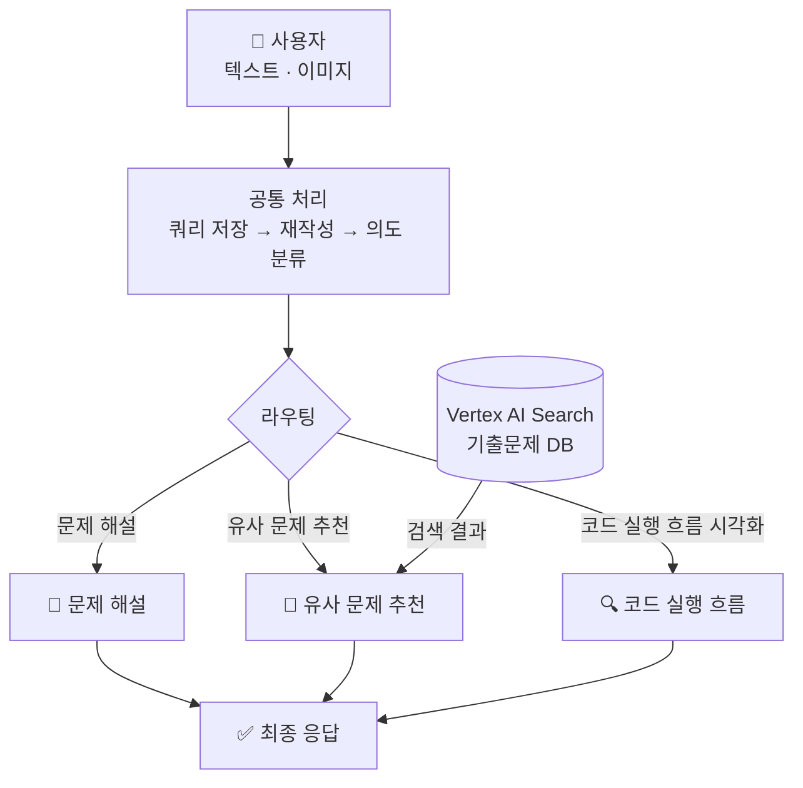
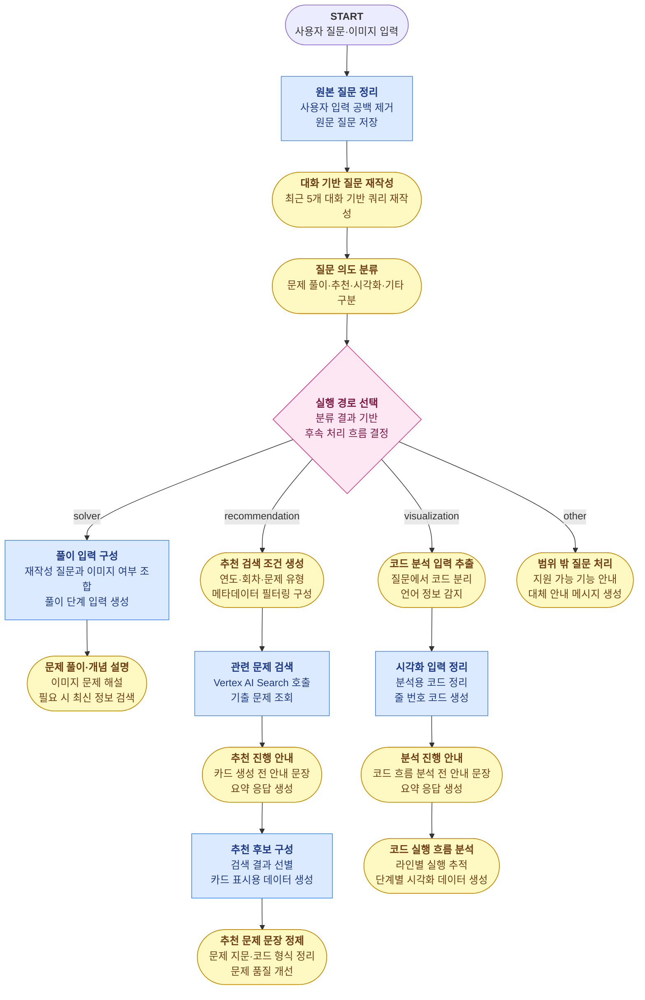

# 정보처리기사 실기 학습을 위한 지능형 플랫폼

## 목차
- [동기](#동기)
- [사용 기술 및 도구](#사용-기술-및-도구)
- [전체 흐름](#전체-흐름)
- [크롤링](#크롤링)
- [임베딩 전략](#임베딩-전략)
- [Vertex AI Search 적재 / 검색](#vertex-ai-search-적재--검색)
- [Google ADK 에이전트 프로세스](#google-adk-에이전트-프로세스)
- [스트림 데이터 전송 흐름](#스트림-데이터-전송-흐름)

---

## 1️⃣ 동기

- **주제별 문제 탐색의 어려움**  
  특정 개념(예: C 언어 이중 포인터, 자바 업캐스팅)에 특화된 문제 연습의 한계. 기존 기출·복원 자료의 회차별 구성에 따른 주제별 탐색 번거로움 해소를 위해 RAG 기반 벡터 검색 적용.

- **복잡한 코드 실행 흐름 추적의 한계**  
  자바의 상속·업캐스팅이나 C의 포인터·재귀 등 복잡한 제어 흐름 및 메모리 변화 파악의 어려움. 단계별 디버깅 방식의 시각화(Tracer) 기능을 통한 이해도 제고.

---

## 2️⃣ 사용 기술 및 도구

### Google ADK (Agent Development Kit) `v2.0`

Google ADK 기반의 에이전트 오케스트레이션 전반 구현.

| 기능 | 사용 위치 | 설명 |
|------|-----------|------|
| **`Workflow`** | `agent.py` | 전체 에이전트 그래프 정의. 엣지(edge) 목록을 통한 노드 간 실행 순서·분기 선언. |
| **`Agent` (LlmAgent)** | `llm_agents/{route}/` | Gemini 모델 래핑 LLM 에이전트. `instruction`, `output_schema`, `output_key` 등 설정 관리. |
| **`Event`** | `llm_agents/{route}/`, `nodes/{route}/`, `runner/workflow_runner.py` | 노드·Agent 실행 결과를 다음 단계로 전달하는 ADK 이벤트 객체. LLM Agent는 `output_key`로 결과를 `session.state`에 저장하고, Function Node는 `Event(state=...)`로 state를 직접 갱신. |
| **`InMemoryRunner`** | `runner/workflow_runner.py` | 워크플로우 실행 러너. 세션 및 아티팩트 서비스 내장. |
| **`RunConfig` + `StreamingMode.SSE`** | `runner/workflow_runner.py` | ADK Workflow를 스트리밍 모드로 실행해 원본 ADK 이벤트를 순차 반환. |
| **`session_service`** | `runner/workflow_runner.py` | `InMemoryRunner` 내장 인메모리 세션 서비스. 세션 생성·조회 및 `state` 딕셔너리를 통한 노드 간 데이터 공유 관리. |
| **`Artifact Service`** | `artifacts/image.py` | `InMemoryRunner` 내장 인메모리 아티팩트 서비스. 이미지 업로드 시 아티팩트 저장 및 참조 처리. |
| **`callbacks`** | `callbacks/` | 에이전트 실행 완료 후 추천 카드·Tracer 결과를 최종 응답 형태로 정리하는 후처리 모듈. |
| **`google_search`** | `llm_agents/solver/solver_agent.py` | 문제 해설 및 시험 일정·출제 범위·합격 기준 같은 최신 정보 조회 시 Google 검색을 ADK 기본 도구로 활용. |
| **`output_schema`** | `llm_agents/{route}/` | Pydantic 스키마를 통한 구조화된 LLM 출력 강제. |

### 그 외 기술 스택

| 분류 | 기술 |
|------|------|
| **API 서버** | FastAPI · Uvicorn |
| **LLM** | Google Gemini |
| **벡터 검색 (RAG)** | Vertex AI Search |
| **크롤링** | BeautifulSoup4 · urllib |

---

## 3️⃣ 전체 흐름



---

## 4️⃣ 크롤링

### 출처

티스토리 블로그 **[chobopark.tistory.com](https://chobopark.tistory.com)** — 정보처리기사 실기 기출·복원 문제 회차별 정리 사이트. 2020년~2025년 총 19개 회차 URL 코드 명시 및 데이터 수집 수행.

### 크롤링 전략

Tistory 포스트 구조 분석 기반 데이터 추출 규칙 적용.

| 항목 | 추출 방법 |
|---|---|
| **문제 본문** | `tt_article_useless_p_margin` 컨테이너 내 h3 이후 노드 순차 탐색. |
| **정답 / 해설 분리** | Tistory `moreLess` 내 텍스트 색상 기준 분리 (청록: 정답, 파랑: 해설). |
| **코드 블록** | `colorscripter-code-table` 클래스 및 배경색 기반 소스코드 추출. |
| **이미지** | 문제 본문 이미지 및 답안 블록 내 이미지 수집. |
| **과부하 방지** | 요청 간 1.5초 딜레이 설정. |

### 출력 형식

문항 1개당 JSONL 1줄 구성 (`data/정보처리기사_실기_기출문제.jsonl`).

```json
{
  "id": "2024_01_05",
  "year": 2024,
  "round": 1,
  "exam_title": "2024년 1회 정보처리기사 실기 기출문제 복원",
  "question_number": 5,
  "question": "다음 Java 소스코드의 실행 결과를 쓰시오.\n\npublic class Test {\n  public static void main(String[] args) {\n    System.out.print(\"Result: \" + (10 + 20));\n  }\n}",
  "images": [],
  "answer": "Result: 30",
  "answer_images": [],
  "explanation": "",
  "source_url": "https://chobopark.tistory.com/476",
  "crawled_at": "2026-04-23T15:46:46Z"
}
```

---

## 5️⃣ 임베딩 전략

크롤링 결과 가공을 통한 Vertex AI Search 적재용 문서 구성 (`vertexai_search_etl/build_datastore.py`).

### 기본 원칙

시험 1문항당 1건의 문서 구성. 이미지 제공 문항의 경우 이번 단계에서 제외 처리 (추후 OCR 도입 시 개선 가능).

### content 필드 구성

벡터 검색 핵심 필드인 `content`를 문제·정답·해설 구역 레이블로 통합하여 단일 텍스트로 구성.

```text
[문제] 다음 Java 소스코드의 실행 결과를 쓰시오.

public class Test {
  public static void main(String[] args) {
    System.out.print("Result: " + (10 + 20));
  }
}
[정답] Result: 30
[해설] 정수 10과 20을 더한 값(30)을 문자열과 결합하여 출력하는 기본적인 Java 프로그래밍 문항임.
```

해설이 없는 경우, [해설] 필드는 제외

---

## 6️⃣ Vertex AI Search 적재 / 검색

### 적재 (Upload)

생성된 `vector_store_vertexai.jsonl`을 Discovery Engine REST API를 통해 문서 단위 업로드 수행.

**API 흐름**
- 신규 생성: `POST` 요청을 통한 `.../branches/{branch}/documents?documentId={id}` 엔드포인트 호출.

**요청 바디 예시**
```json
{
  "structData": {
    "year": 2024,
    "round": 1,
    "question_type": "java",
    "question_category": "code",
    "code_language": "java"
  },
  "content": {
    "mimeType": "text/plain",
    "rawBytes": "<base64 인코딩된 [문제]/[정답]/[해설] 텍스트>"
  }
}
```

---

### 검색 (Search)

유사 문제 추천 시 에이전트 내부 호출 수행. 의미 기반(Semantic) 검색 및 메타데이터 필터 병행 적용.

**API 엔드포인트**
```
POST https://discoveryengine.googleapis.com/v1alpha/
  projects/{PROJECT}/locations/{LOCATION}/collections/default_collection/
  engines/{ENGINE_ID}/servingConfigs/default_search:search
```

**요청 페이로드 예시**
```json
{
  "query": "Java 업캐스팅 관련 문제 찾아줘",
  "pageSize": 10,
  "filter": "year >= 2022 AND question_type: ANY(\"java\")",
  "relevanceFilterSpec": {
    "keywordSearchThreshold": {"relevanceThreshold": "HIGH"},
    "semanticSearchThreshold": {"semanticRelevanceThreshold": 0.7}
  },
  "contentSearchSpec": {"searchResultMode": "CHUNKS"}
}
```

**메타데이터 필터 옵션 (`VertexExamSearchMetadata`)**
| 필드 | 타입 | 설명 | 예시 |
|---|---|---|---|
| `years` | `tuple[int]` | 특정 연도 검색 | `(2023, 2024)` |
| `year_min` / `year_max` | `int` | 연도 범위 지정 | `year_min=2022` |
| `rounds` | `tuple[int]` | 특정 회차 지정 | `(1, 2)` |
| `question_types` | `tuple[str]` | 문제 유형 필터링 | `("java", "concept")` |

---

## 7️⃣ Google ADK 에이전트 프로세스


### 전체 워크플로우 구조

<span style="display:inline-block;padding:4px 10px;border-radius:8px;background:#dbeafe;color:#1e3a8a;border:1px solid #3b82f6;font-weight:600;">Python Function Node</span>
<span style="display:inline-block;padding:4px 10px;border-radius:8px;background:#fef9c3;color:#713f12;border:1px solid #ca8a04;font-weight:600;">LLM Agent</span>



### 워크플로우 구현 파일

#### 공통 처리

- [워크플로 실행 진입점](../smart_learning_agent/runner/workflow_runner.py) · `Runner`
- [원본 질문 정리](../smart_learning_agent/nodes/common/query_rewrite.py) · `Python Function Node`
- [대화 기반 질문 재작성](../smart_learning_agent/llm_agents/common/query_rewrite_agent.py) · `LLM Agent`
- [질문 의도 분류](../smart_learning_agent/llm_agents/common/intent_agent.py) · `LLM Agent`
- [실행 경로 선택](../smart_learning_agent/nodes/common/router.py) · `Router`

#### 문제 풀이·개념 설명 라우트

- [풀이 입력 구성](../smart_learning_agent/nodes/solver/solver_nodes.py) · `Python Function Node`
- [문제 풀이·개념 설명](../smart_learning_agent/llm_agents/solver/solver_agent.py) · `LLM Agent`

#### 유사 문제 추천 라우트

- [추천 검색 조건 생성](../smart_learning_agent/llm_agents/recommendation/filter_agent.py) · `LLM Agent`
- [관련 문제 검색](../smart_learning_agent/nodes/recommendation/vertexai_search_nodes.py) · `Python Function Node`
- [추천 진행 안내](../smart_learning_agent/llm_agents/recommendation/curator_intro_agent.py) · `LLM Agent`
- [추천 후보 구성](../smart_learning_agent/nodes/recommendation/curator_output_nodes.py) · `Python Function Node`
- [추천 문제 문장 정제](../smart_learning_agent/llm_agents/recommendation/question_refine_agent.py) · `LLM Agent`

#### 코드 실행 흐름 시각화 라우트

- [코드 분석 입력 추출](../smart_learning_agent/llm_agents/visualization/tracer_input_agent.py) · `LLM Agent`
- [시각화 입력 정리](../smart_learning_agent/nodes/visualization/tracer_nodes.py) · `Python Function Node`
- [분석 진행 안내](../smart_learning_agent/llm_agents/visualization/tracer_intro_agent.py) · `LLM Agent`
- [코드 실행 흐름 분석](../smart_learning_agent/llm_agents/visualization/tracer_agent.py) · `LLM Agent`

#### 범위 밖 질문 처리 라우트

- [범위 밖 질문 처리](../smart_learning_agent/llm_agents/fallback/fallback_agent.py) · `LLM Agent`

## 8️⃣ 스트림 데이터 전송 흐름

ADK Workflow는 `runner/workflow_runner.py`의 `execute_agent_stream()`에서 아래 설정으로 실행.

```py
RunConfig(
    streaming_mode=StreamingMode.SSE
)
```

프론트엔드는 `/chat/stream`으로 요청을 한 번 보내고, 백엔드는 연결을 유지한 채 ADK Workflow 이벤트를 SSE 형식으로 순차 전송.

```text
Frontend
  -> POST /chat/stream
FastAPI
  -> runner.execute_agent_stream(...)
ADK Runner
  -> workflow_runner.run_async(streaming_mode=SSE)
ADK Workflow
  -> 원본 ADK Event 반환
FastAPI
  -> ADK Event를 state/chunk/curation/tracer/done 등으로 변환
Frontend
  -> 상태 말풍선, 답변 청크, 추천 카드, 시각화 결과 표시
```

### SSE 이벤트 타입

| `type` | 의미 | 프론트 처리 |
|---|---|---|
| `state` | 현재 실행 중인 처리 단계. 새 단계를 처음 만났을 때 전송. | 상태 말풍선/로딩 문구 갱신. |
| `chunk` | 사용자에게 보여줄 텍스트 조각. | 채팅 말풍선에 텍스트 누적. |
| `stream_end` | 한 스트리밍 노드의 텍스트 출력 종료. 전체 요청 종료와 구분. | 현재 말풍선 스트리밍 종료 처리. |
| `curation` | 추천 문제 카드 최종 데이터. | 추천 카드 UI 렌더링. |
| `tracer` | 코드 실행 흐름 최종 데이터. | Tracer 시각화 UI 렌더링. |
| `error` | 사용자에게 보여줄 오류 메시지. | 오류 말풍선 표시. |
| `done` | 전체 `/chat/stream` 요청 종료. | 요청 마무리. |

### 샘플 예시

사용자 질문: `C언어 이중 포인터 문제 알려줘`

추천 요청에서 실제 SSE 이벤트는 아래 순서로 전송.

```text
data: {"type":"state","node":"query_preprocess_func"}
-> 프론트: "질문을 정리하는 중이에요..."

data: {"type":"state","node":"query_rewrite_agent"}
-> 프론트: "질문을 다듬는 중이에요..."

data: {"type":"state","node":"intent_classification_agent"}
-> 프론트: "질문 의도를 파악하는 중이에요..."

data: {"type":"state","node":"intent_router"}
-> 프론트: "질문 의도를 파악하는 중이에요..."

data: {"type":"state","node":"filter_agent"}
-> 프론트: "추천 결과를 필터링하는 중이에요..."

data: {"type":"state","node":"vertex_search_func"}
-> 프론트: "관련 문제를 검색하는 중이에요..."

data: {"type":"state","node":"curator_intro_agent"}
-> 프론트: 추천 안내 문장 말풍선 준비

data: {"type":"chunk","text":"C언어 이중 포인터를 연습할 수 있는 "}
-> 프론트: 채팅 말풍선에 텍스트 누적

data: {"type":"chunk","text":"문제를 찾아보고 있어요. "}
-> 프론트: 채팅 말풍선에 텍스트 누적

data: {"type":"chunk","text":"주소 참조와 간접 참조를 중심으로 추천해드릴게요."}
-> 프론트: 채팅 말풍선에 텍스트 누적

data: {"type":"stream_end"}
-> 프론트: 안내 문장 스트리밍 종료

data: {"type":"state","node":"build_curator_output_func"}
-> 프론트: "결과를 보기 좋게 정리하는 중이에요..."

data: {"type":"state","node":"question_refine_agent"}
-> 프론트: "문제를 다듬는 중이에요..."

data: {"type":"curation","route":"recommendation","title":"맞춤 추천 문제 카드","problemCards":[...],"message":null}
-> 프론트: 추천 카드 UI 표시

data: {"type":"done"}
-> 프론트: 요청 종료
```