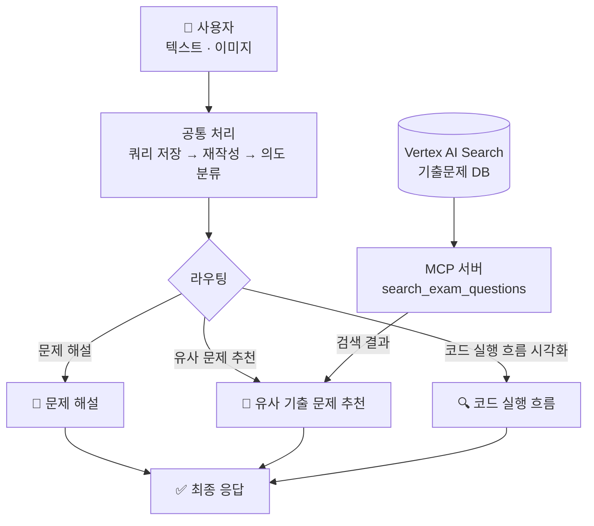
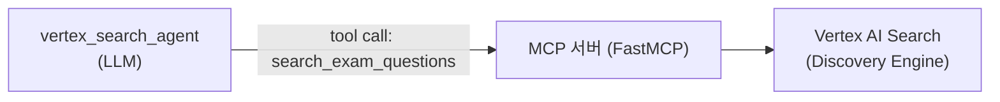
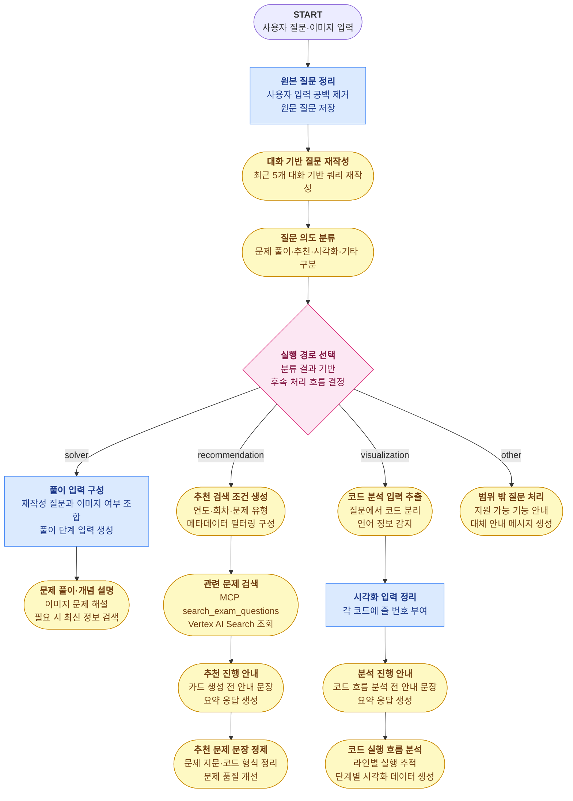
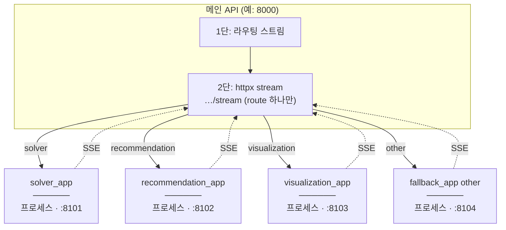

# 정보처리기사 실기 학습을 위한 지능형 플랫폼

## 목차
- [1️⃣ 동기](#동기)
- [2️⃣ 사용 기술 및 도구](#사용-기술-및-도구)
- [3️⃣ 전체 흐름](#전체-흐름)
- [4️⃣ 크롤링](#크롤링)
- [5️⃣ 임베딩 전략](#임베딩-전략)
- [6️⃣ Vertex AI Search 적재 / 검색](#vertex-ai-search-적재--검색)
- [7️⃣ MCP](#mcp-추천-검색-연동)
- [8️⃣ Google ADK 에이전트 프로세스](#google-adk-에이전트-프로세스)
- [9️⃣ A2A route](#a2a-route-서비스)
- [🔟 스트림 데이터 전송 흐름](#스트림-데이터-전송-흐름)

---

<a id="동기"></a>

## 1️⃣ 동기

- **주제별 문제 탐색의 어려움**  
  특정 개념(예: C 언어 이중 포인터, 자바 업캐스팅)에 특화된 문제 연습의 한계. 기존 기출·복원 자료의 회차별 구성에 따른 주제별 탐색 번거로움 해소 목적의 RAG 기반 벡터 검색 적용.

- **복잡한 코드 실행 흐름 추적의 한계**  
  자바의 상속·업캐스팅이나 C의 포인터·재귀 등 복잡한 제어 흐름 및 메모리 변화 파악의 어려움. 단계별 디버깅 방식의 시각화(Tracer) 기능을 통한 이해도 향상.

---

<a id="사용-기술-및-도구"></a>

## 2️⃣ 사용 기술 및 도구

### Google ADK (Agent Development Kit) `v2.0`

| 기능 | 사용 위치 | 설명 |
|------|-----------|------|
| **`Workflow`** | [`agent.py`](../smart_learning_agent/agent.py) | 전체 그래프(어떤 노드를 어떤 순서·조건으로 돌릴지) 정의. |
| **`Agent` (LlmAgent)** | [`llm_agents/`](../smart_learning_agent/llm_agents/) | Gemini를 부르는 LLM 단계. 프롬프트(`instruction`), 출력 형식(`output_schema`), state에 쓸 키(`output_key`) 등. |
| **`Event`** | [`llm_agents/`](../smart_learning_agent/llm_agents/), [`nodes/`](../smart_learning_agent/nodes/), [`workflow_runner.py`](../smart_learning_agent/runner/workflow_runner.py) | 결론적으로는 “노드/에이전트 결과를 전달하고 state를 공유하기 위한 메세지 객체. LLM Agent 는 `output_key`로 나온 값을 `session.state`에 넣고, 함수 노드는 `Event(state={...})`로 갱신할 값을 넘김. |
| **`InMemoryRunner`** | [`workflow_runner.py`](../smart_learning_agent/runner/workflow_runner.py) | 워크플로를 실제로 돌리는 러너(세션·이미지 등 메모리 안에서 처리). |
| **`RunConfig` + `StreamingMode.SSE`** | [`workflow_runner.py`](../smart_learning_agent/runner/workflow_runner.py) | 스트리밍 모드로 돌려서 ADK 이벤트를 순서대로 밖으로 보냄. |
| **`session_service`** | [`workflow_runner.py`](../smart_learning_agent/runner/workflow_runner.py) | 세션 만들기·조회, 노드끼리 나누는 `state` 딕셔너리 관리. |
| **`Artifact Service`** | [`image.py`](../smart_learning_agent/artifacts/image.py) | 이미지 업로드 등 아티팩트 저장·참조. |
| **`callbacks`** | [`callbacks/`](../smart_learning_agent/callbacks/) | 실행이 끝난 뒤 추천 카드·Tracer 결과를 응답 형태로 다듬는 후처리. |
| **`google_search`** | [`solver_agent.py`](../smart_learning_agent/llm_agents/solver/solver_agent.py) | 풀이 단계에서 시험 일정·범위 같은 최신 정보가 필요할 때 Google 검색 도구 사용. |
| **`output_schema`** | [`llm_agents/`](../smart_learning_agent/llm_agents/) | Pydantic으로 LLM 출력 모양 고정. |

---

<a id="전체-흐름"></a>

## 3️⃣ 전체 흐름



MCP 도구 응답은 `after_tool_callback`인 `save_vertex_search_result`에서 파싱되어 `rec_search_results`(문제 리스트) 같은 state 키로 저장됩니다.

---

<a id="크롤링"></a>

## 4️⃣ 크롤링

### 출처

티스토리 블로그 **[chobopark.tistory.com](https://chobopark.tistory.com)** — 정보처리기사 실기 기출·복원 문제 회차별 정리 사이트. 2020년~2025년 총 19개 회차 URL 코드 명시 및 데이터 수집 수행.

### 크롤링 전략

Tistory 포스트 구조 분석 기반 데이터 추출 규칙 적용.

| 항목 | 추출 방법 |
|---|---|
| **문제 본문** | `tt_article_useless_p_margin` 컨테이너 내 h3 이후 노드 순차 탐색. |
| **정답 / 해설 분리** | Tistory `moreLess` 내 텍스트 색상 기준 분리 (청록: 정답, 파랑: 해설). |
| **코드 블록** | `colorscripter-code-table` 클래스 및 배경색 기반 소스코드 추출. |
| **이미지** | 문제 본문 이미지 및 답안 블록 내 이미지 수집. |
| **과부하 방지** | 요청 간 1.5초 딜레이 설정. |

### 출력 형식

문항 1개당 JSONL 1줄 구성 (`data/정보처리기사_실기_기출문제.jsonl`).

```json
{
  "id": "2024_01_05",
  "year": 2024,
  "round": 1,
  "exam_title": "2024년 1회 정보처리기사 실기 기출문제 복원",
  "question_number": 5,
  "question": "다음 Java 소스코드의 실행 결과를 쓰시오.\n\npublic class Test {\n  public static void main(String[] args) {\n    System.out.print(\"Result: \" + (10 + 20));\n  }\n}",
  "images": [],
  "answer": "Result: 30",
  "answer_images": [],
  "explanation": "",
  "source_url": "https://chobopark.tistory.com/476",
  "crawled_at": "2026-04-23T15:46:46Z"
}
```

---

<a id="임베딩-전략"></a>

## 5️⃣ 임베딩 전략

크롤링한 JSON 결과를 가공해 Vertex AI Search에 적재 (`vertexai_search_etl/build_datastore.py`).

### 기본 원칙

시험 1문항당 1건의 문서 구성

### content 필드 (임베딩 하는 필드) 구성

검색에 쓰는 `content` 한 칸에 [문제][정답][해설]을 한 덩어리 텍스트로 붙여 넣음.

```text
[문제] 다음 Java 소스코드의 실행 결과를 쓰시오.

public class Test {
  public static void main(String[] args) {
    System.out.print("Result: " + (10 + 20));
  }
}
[정답] Result: 30
[해설] 정수 10과 20을 더한 값(30)을 문자열과 결합하여 출력하는 기본적인 Java 프로그래밍 문항임.
```

해설 없음 시 [해설] 필드 제외 규칙.

---

<a id="vertex-ai-search-적재--검색"></a>

## 6️⃣ Vertex AI Search 적재 / 검색

### 적재 (Upload)

만든 `vector_store_vertexai.jsonl`을 Discovery Engine REST API로 **문서 단위 업로드**.

**API 흐름**
- `POST` 요청을 통한 `.../branches/{branch}/documents?documentId={id}` 엔드포인트 호출.

**요청 바디 예시**
```json
{
  "structData": {
    "year": 2024,
    "round": 1,
    "question_type": "java",
    "question_category": "code",
    "code_language": "java"
  },
  "content": {
    "mimeType": "text/plain",
    "rawBytes": "<base64 인코딩된 [문제]/[정답]/[해설] 텍스트>"
  }
}
```

---

### 검색 (Search)

**API 엔드포인트**
```
POST https://discoveryengine.googleapis.com/v1alpha/
  projects/{PROJECT}/locations/{LOCATION}/collections/default_collection/
  engines/{ENGINE_ID}/servingConfigs/default_search:search
```

**요청 페이로드 예시**
- 하이브리드 서치(시맨틱+키워드)
- 메타데이터 필터링

```json
{
  "query": "Java 업캐스팅 관련 문제 찾아줘",
  "pageSize": 10,
  "filter": "year >= 2022 AND question_type: ANY(\"java\")",
  "relevanceFilterSpec": {
    "keywordSearchThreshold": {"relevanceThreshold": "HIGH"},
    "semanticSearchThreshold": {"semanticRelevanceThreshold": 0.7}
  },
  "contentSearchSpec": {"searchResultMode": "CHUNKS"}
}
```

---

<a id="mcp-추천-검색-연동"></a>

## 7️⃣ MCP

추천(recommendation)일 때만: 메인 앱은 Vertex AI Search를 직접 호출하지 않고, **FastMCP 기반 MCP 서버**를 통해 검색합니다. `vertex_search_agent`(LLM)는 MCP의 도구 중 **`search_exam_questions` 1개만** 호출합니다.



### FastMCP 프레임워크 사용

- [`mcp_server/vertexai_search/server.py`](../mcp_server/vertexai_search/server.py)에서
  - `mcp = FastMCP(...)`로 MCP 인스턴스 생성
  - `@mcp.tool()`로 툴(예: `search_exam_questions`) 생성
  - `mcp.run()`로 실행

### VertexAI Search Tool 

- VertexAI Search용 MCP 툴(`search_exam_questions`)을 만들어 LLM이 호출합니다.
- `page_size`는 기본 `3`으로 제한합니다.

### ADK LLM agent에서 MCP 호출

```python
# smart_learning_agent/llm_agents/recommendation/vertex_search_agent.py
vertex_search_agent = Agent(
    # (생략),,,
    tools=[
        McpToolset(
            connection_params=StreamableHTTPConnectionParams(
                url="http://127.0.0.1:8200/mcp",
            ),
            tool_filter=["search_exam_questions"],  # LLM 노출 툴을 1개로 제한
        )
    ],
    description="Vertex AI Search MCP Tool로 추천 후보 문제를 검색하는 에이전트",
)
```

---

<a id="google-adk-에이전트-프로세스"></a>

## 8️⃣ Google ADK 에이전트 프로세스

### 전체 워크플로우 구조

<span style="display:inline-block;padding:4px 10px;border-radius:8px;background:#dbeafe;color:#1e3a8a;border:1px solid #3b82f6;font-weight:600;">Python Function Node</span>
<span style="display:inline-block;padding:4px 10px;border-radius:8px;background:#fef9c3;color:#713f12;border:1px solid #ca8a04;font-weight:600;">LLM Agent</span>



### 워크플로우 구현 파일

#### 공통 처리

- [워크플로 실행 진입점](../smart_learning_agent/runner/workflow_runner.py) · `Runner`
- [원본 질문 정리](../smart_learning_agent/nodes/common/query_rewrite.py) · `Python Function Node`
- [대화 기반 질문 재작성](../smart_learning_agent/llm_agents/common/query_rewrite_agent.py) · `LLM Agent`
- [질문 의도 분류](../smart_learning_agent/llm_agents/common/intent_agent.py) · `LLM Agent`
- [실행 경로 선택](../smart_learning_agent/nodes/common/router.py) · `Router`

#### 문제 풀이·개념 설명 라우트

- [풀이 입력 구성](../smart_learning_agent/nodes/solver/solver_nodes.py) · `Python Function Node`
- [문제 풀이·개념 설명](../smart_learning_agent/llm_agents/solver/solver_agent.py) · `LLM Agent`

#### 유사 문제 추천 라우트

- [메타 필터 생성](../smart_learning_agent/llm_agents/recommendation/filter_agent.py) · `LLM Agent` (`VertexFilterOutput`)
- [MCP 검색](../smart_learning_agent/llm_agents/recommendation/vertex_search_agent.py) · `LLM Agent + McpToolset(search_exam_questions)`
- [추천 진행 안내](../smart_learning_agent/llm_agents/recommendation/curator_intro_agent.py) · `LLM Agent`
- [추천 문제 문장 정제](../smart_learning_agent/llm_agents/recommendation/question_refine_agent.py) · `LLM Agent`

#### 코드 실행 흐름 시각화 라우트

- [코드 분석 입력 추출](../smart_learning_agent/llm_agents/visualization/tracer_input_agent.py) · `LLM Agent`
- [시각화 입력 정리](../smart_learning_agent/nodes/visualization/tracer_nodes.py) · `Python Function Node`
- [분석 진행 안내](../smart_learning_agent/llm_agents/visualization/tracer_intro_agent.py) · `LLM Agent`
- [코드 실행 흐름 분석](../smart_learning_agent/llm_agents/visualization/tracer_agent.py) · `LLM Agent`

#### 범위 밖 질문 처리 라우트

- [범위 밖 질문 처리](../smart_learning_agent/llm_agents/fallback/fallback_agent.py) · `LLM Agent`

---

<a id="a2a-route-서비스"></a>

## 9️⃣ A2A route 

### 구조 요약

풀이/추천/시각화/기타처럼 **route마다 전용 서버(작은 앱)** 를 따로 띄워서, 해당 route의 에이전트(워크플로)를 분리

### 나눈 이유

- **안정성(격리)**: 추천(MCP/Vertex), 시각화(코드/긴 추론), 풀이 처럼 성격이 다른 작업을 분리해두면, 한 route에서 지연/오류가 나도 **전체가 같이 불안정해질 가능성을 줄일 수 있음.**
- **스케일링(선택적 확장)**: 트래픽이 특정 route(예: 추천)에 몰리면, 전체를 키우는 대신 **그 route 서버만 여러 개 더 띄워서 확장**할 수 있음. 이때 메인 API는 추천 서버 URL을 **로드밸런싱** 해서 요청을 나눠 보낼 수 있음



### 프로세스 요약

1) **AgentCard**
- “이 서버가 어떤 에이전트를 제공하는지”를 설명하는 **메타데이터(소개 카드)**

```python
# a2a_remote_routes/cards.py (요약)
agent_card = AgentCard(
    name="recommendation_route_workflow",  # A2A에서 보이는 "에이전트 이름"(보통 workflow/agent name)
    description="정보처리기사 실기 유사 문제 추천 route",  # 이 에이전트가 무엇을 하는지 한 줄 설명
    url="http://localhost:8102/",  # 이 route 서버의 기본 주소(AgentCard가 가리키는 엔드포인트)
    capabilities=AgentCapabilities(streaming=True),  # 스트리밍(SSE/RPC stream) 지원 여부
    )
    ],skills=[
        AgentSkill(
            id="recommendation_route",  # 스킬 식별자(프로그램이 구분하기 위한 id)
            name="recommendation route",  # 사람이 보는 스킬 이름
            description="정보처리기사 실기 유사 문제 추천 route",  # 스킬 설명(AgentCard description과 비슷해도 됨)
        
)
```

2) **`stream_bridge`**
- **SSE(Server‑Sent Events) 기반 스트리밍을 위한 라우터(`/stream`) 추가**
- 현재 통신은 **SSE(Server‑Sent Events) 기반 스트리밍**
- 프론트에서 요청이 오면 먼저 **메인 백엔드에서 라우팅까지 처리**하고, 라우트가 결정되면 **해당 route 에이전트 서버가 스트리밍을 이어서 처리**할 수 있도록 `/stream` 엔드포인트를 추가 및 구현

```python
# 1) route 서버에 /stream 엔드포인트를 달아둠 (요약)
app.add_route("/stream", make_stream_endpoint(route), methods=["POST"])
```

3) **노출(Expose)**
- `to_a2a(...)`로 A2A 서버로 노출 가능한 앱 생성”.

```python
# a2a_remote_routes/apps.py (요약)
from google.adk.a2a.utils.agent_to_a2a import to_a2a

app = to_a2a(
    agent,                 # route workflow (예: recommendation_route_workflow)
    agent_card=agent_card, # 1) AgentCard
    runner=get_route_runner(route),
)
```

---

<a id="스트림-데이터-전송-흐름"></a>

## 🔟 프론트 ↔ 백엔드 SSE 스트리밍 통신 구조

### 요약

- **통신은 SSE(Server‑Sent Events) 기반 스트리밍**
- 프론트는 `/chat/stream`으로 요청을 **한 번만** 보내고, 백엔드는 연결을 닫지 않은 채 `text/event-stream`으로 이벤트를 순서대로 내려줌
- 백엔드는 **2단 구조**로 스트림을 이어붙임
  - **1단(메인)**: 현재 진입한 노드에서, 상태 스트리밍 (라우팅(workflow)까지만)
  - **2단(route 서버)**: 라우트가 결정되면 해당 route 서버의 `/stream`이 이후 스트리밍을 이어서 생성


### 예시

실제 전송은 아래처럼 `data: ...` 블록이 순서대로 이어짐.
- 질문 : C언어 이중포인터 문제 찾아줘

```text
data: {"type":"state","node":"query_preprocess_func"}
-> 프론트: "질문을 정리하는 중이에요..." 

data: {"type":"state","node":"query_rewrite_agent"}
-> 프론트: "질문을 다듬는 중이에요..." 

data: {"type":"state","node":"intent_classification_agent

data: {"type":"state","node":"intent_router"}
-> 프론트: "라우팅하는 중이에요..." 

data: {"type":"state","node":"filter_agent"}
-> 프론트: "추천 검색 조건을 만드는 중이에요..." 

data: {"type":"state","node":"vertex_search_agent"}
-> 프론트: "추천 검색을 진행하는 중이에요..." 같은 상태 말풍선 표시

data: {"type":"state","node":"curator_intro_agent"}
-> 프론트: 상태 말풍선 유지 + 아래 채팅 말풍선 스트리밍 시작 준비

data: {"type":"chunk","text":"C언어 이중 포인터를 연습할 수 있는 "}
-> 프론트: 채팅 말풍선에 텍스트가 실시간으로 이어 붙음(스트리밍)

data: {"type":"chunk","text":"문제를 찾아보고 있어요. "}
-> 프론트: 같은 말풍선에 텍스트 추가(스트리밍)

data: {"type":"chunk","text":"주소 참조와 간접 참조를 중심으로 추천해드릴게요."}
-> 프론트: 같은 말풍선에 텍스트 추가(스트리밍)

data: {"type":"stream_end"}
-> 프론트: "안내 문장" 스트리밍 종료 처리(말풍선 출력 완료)

data: {"type":"state","node":"build_curator_output_func"}
-> 프론트: "추천 결과를 정리하는 중이에요..." 

data: {"type":"state","node":"question_refine_agent"}
-> 프론트: "문제를 다듬는 중이에요..." 

data: {"type":"curation","route":"recommendation","title":"맞춤 추천 문제 카드","problemCards":[...],"message":null}
-> 프론트: 추천 카드 UI 렌더링(카드 리스트 표시)

data: {"type":"done"}
-> 프론트: 요청 종료(로딩/상태 종료, 입력 가능 상태)

```