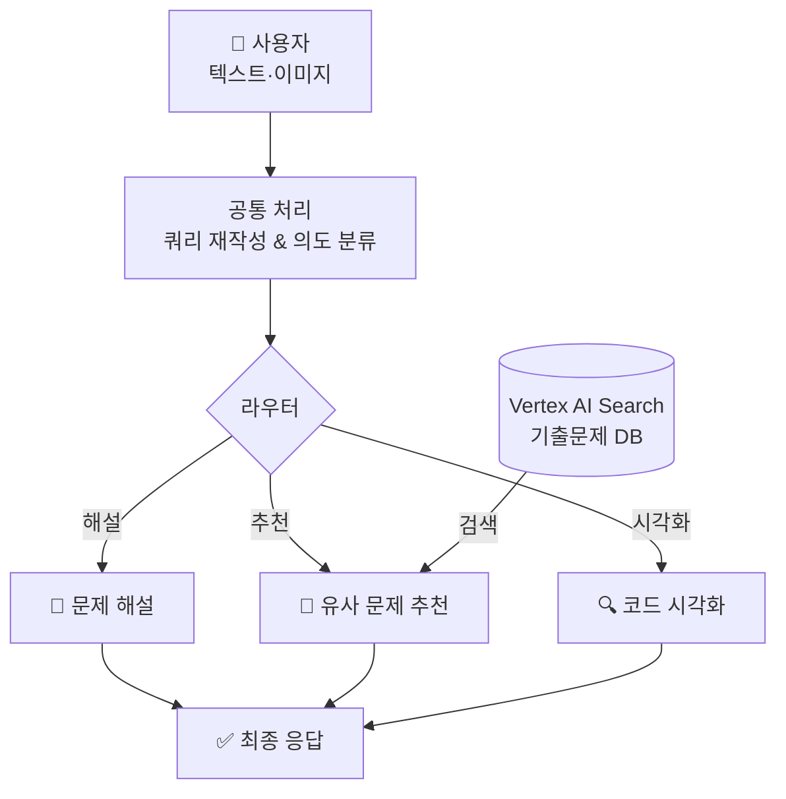

# 지능형 정보처리기사 학습 플랫폼 (Smart Learning Platform)

정보처리기사 실기 학습 효율화를 위한 AI 기반 문제 해설, 추천 및 코드 시각화 시스템.

## 목차
- [동기](#동기)
- [기술 스택](#기술-스택)
- [시스템 아키텍처](#시스템-아키텍처)
- [데이터 수집 (크롤링)](#데이터-수집-크롤링)
- [RAG 및 검색 전략](#rag-및-검색-전략)
- [Google ADK 에이전트 설계](#google-adk-에이전트-설계)
- [API 및 스트리밍 서비스](#api-및-스트리밍-서비스)

---

## 동기

- **주제별 학습 편의성 강화**: 회차별 기출 자료를 주제별(이중 포인터, 업캐스팅 등)로 재구성하여 집중 학습 지원.
- **코드 실행 가시성 확보**: 텍스트 위주의 해설 한계를 극복하기 위해 메모리 변화 및 제어 흐름 시각화(Tracer) 제공.

---

## 기술 스택

### Google ADK (Agent Development Kit) v2.0
- **Workflow**: 에이전트 그래프 및 노드 간 실행 흐름 정의.
- **Agent**: Gemini 모델 기반 LLM 에이전트. 페르소나 및 출력 스키마 관리.
- **Context Cache**: 대규모 시스템 프롬프트 캐싱을 통한 토큰 비용 절감.
- **Event Compaction**: 장기 세션 이력을 요약·압축하여 컨텍스트 윈도우 최적화.
- **InMemoryRunner**: 세션, 아티팩트, 워크플로우 통합 실행 환경.

### 인프라 및 라이브러리
- **LLM**: Google Gemini (Flash/Pro)
- **Vector Search**: Vertex AI Search (RAG 구현)
- **API Server**: FastAPI / Uvicorn
- **Data Scraper**: BeautifulSoup4 / lxml

---

## 시스템 아키텍처

---

## 데이터 수집 (크롤링)

### 수집 개요
- **출처**: [chobopark.tistory.com](https://chobopark.tistory.com) (정처기 기출 전문 사이트)
- **범위**: 2020년 ~ 2025년 총 19개 회차 복원 문제.

### 추출 전략
- **본문**: HTML DOM 구조 분석 기반 문항 및 보기 추출.
- **정답/해설**: 특정 색상(청록/파랑) 및 `moreLess` 태그 기준 분리 수집.
- **코드**: `colorscripter` 클래스 기반 소스코드 원문 보존.
- **저장**: JSONL 형식 (`data/정보처리기사_실기_기출문제.jsonl`).

---

## RAG 및 검색 전략

### 문서 가공 (Build Datastore)
- **단위**: 1문항 1문서 원칙.
- **콘텐츠 통합**: 검색 효율을 위해 [문제], [정답], [해설] 구역을 레이블링하여 단일 필드로 결합.

### Vertex AI Search 연동
- **적재**: Discovery Engine API 활용 구조화 데이터 및 원문 Bytes 업로드.
- **검색**: 시맨틱 검색 기반 유사도 필터링 및 연도/유형별 메타데이터 필터 적용.

---

## Google ADK 에이전트 설계

### 에이전트 워크플로우 (`agent.py`)
- **Query Rewriter**: 사용자 질문을 검색 최적화 형태로 재구성.
- **Intent Classifier**: 질문 의도를 해설/추천/시각화/기타로 분류.
- **Solver Agent**: Google Search 도구 연동을 통한 최신·정확한 문제 풀이 제공.
- **Curator Agent**: 검색 결과 중 사용자 질문과 가장 연관성이 높은 문항 선별.
- **Tracer Agent**: 코드 실행 과정을 단계별(Step-by-step)로 추적하여 데이터 생성.

### 세션 및 상태 관리
- **State**: 노드 간 데이터 공유를 위한 전역 상태 딕셔너리.
- **Artifacts**: 멀티모달 처리를 위한 이미지 바이너리 저장 및 참조 서비스.

---

## API 및 스트리밍 서비스

### FastAPI 엔드포인트
- `POST /chat`: 최종 결과를 단일 JSON 응답으로 반환.
- `POST /chat/stream`: SSE(Server-Sent Events) 기반 실시간 토큰 및 상태 스트리밍.

### 스트리밍 데이터 구조
- **Chunk**: LLM이 생성하는 실시간 텍스트 조각.
- **State**: 현재 활성화된 워크플로우 노드 상태 정보.
- **Curation/Tracer**: 비정형 스트리밍 종료 후 전달되는 구조화된 최종 데이터.

### 성능 최적화
- **SSE 전용 노드 제한**: 내부 로직(분류, 필터링 등) 노출 없이 사용자 대면 메시지만 선별 스트리밍.
- **Intro Agent 활용**: JSON 출력 노드 실행 전 자연어 안내 멘트를 선제적으로 전송하여 체감 대기 시간 단축.