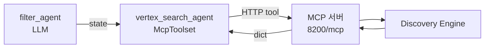
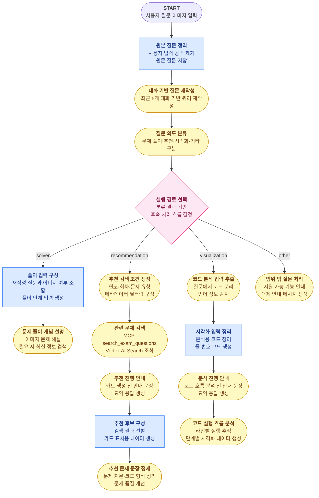
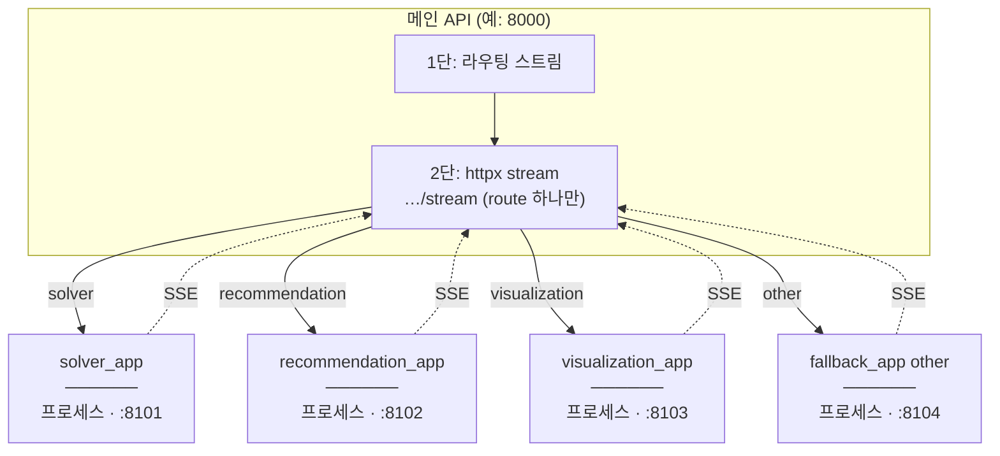

# 정보처리기사 실기 학습을 위한 지능형 플랫폼

## 목차
- [1️⃣ 동기](#동기)
- [2️⃣ 사용 기술 및 도구](#사용-기술-및-도구)
- [3️⃣ 전체 흐름](#전체-흐름)
- [4️⃣ 크롤링](#크롤링)
- [5️⃣ 임베딩 전략](#임베딩-전략)
- [6️⃣ Vertex AI Search 적재 / 검색](#vertex-ai-search-적재--검색)
- [7️⃣ MCP (추천 검색 연동)](#mcp-추천-검색-연동)
- [8️⃣ Google ADK 에이전트 프로세스](#google-adk-에이전트-프로세스)
- [9️⃣ A2A route 서비스](#a2a-route-서비스)
- [🔟 스트림 데이터 전송 흐름](#스트림-데이터-전송-흐름)

**코드 맵 (짧게):** 워크플로 순서 → [agent_workflow.md](agent_workflow.md) · MCP 검색 → [mcp.md](mcp.md) · 의도별 전용 서버·`/stream` → [a2a.md](a2a.md)

---

<a id="동기"></a>

## 1️⃣ 동기

- **주제별 문제 탐색의 어려움**  
  특정 개념(예: C 언어 이중 포인터, 자바 업캐스팅)에 특화된 문제 연습의 한계. 기존 기출·복원 자료의 회차별 구성에 따른 주제별 탐색 번거로움 해소 목적의 RAG 기반 벡터 검색 적용.

- **복잡한 코드 실행 흐름 추적의 한계**  
  자바의 상속·업캐스팅이나 C의 포인터·재귀 등 복잡한 제어 흐름 및 메모리 변화 파악의 어려움. 단계별 디버깅 방식의 시각화(Tracer) 기능을 통한 이해도 향상.

---

<a id="사용-기술-및-도구"></a>

## 2️⃣ 사용 기술 및 도구

### Google ADK (Agent Development Kit) `v2.0`

Google ADK로 **질문 처리 단계(노드)를 이어 붙인 워크플로**를 정의·실행.

| 기능 | 사용 위치 | 설명 |
|------|-----------|------|
| **`Workflow`** | [`agent.py`](../smart_learning_agent/agent.py) | 전체 그래프(어떤 노드를 어떤 순서·조건으로 돌릴지) 정의. |
| **`Agent` (LlmAgent)** | [`llm_agents/`](../smart_learning_agent/llm_agents/) | Gemini를 부르는 LLM 단계. 프롬프트(`instruction`), 출력 형식(`output_schema`), state에 쓸 키(`output_key`) 등. |
| **`Event`** | [`llm_agents/`](../smart_learning_agent/llm_agents/), [`nodes/`](../smart_learning_agent/nodes/), [`workflow_runner.py`](../smart_learning_agent/runner/workflow_runner.py) | 한 단계가 끝날 때 다음 단계로 넘기는 ADK 이벤트. LLM은 `output_key`로 `session.state`에 저장, 함수 노드는 `Event(state=...)`로 state 갱신. |
| **`InMemoryRunner`** | [`workflow_runner.py`](../smart_learning_agent/runner/workflow_runner.py) | 워크플로를 실제로 돌리는 러너(세션·이미지 등 메모리 안에서 처리). |
| **`RunConfig` + `StreamingMode.SSE`** | [`workflow_runner.py`](../smart_learning_agent/runner/workflow_runner.py) | 스트리밍 모드로 돌려서 ADK 이벤트를 순서대로 밖으로 보냄. |
| **`session_service`** | [`workflow_runner.py`](../smart_learning_agent/runner/workflow_runner.py) | 세션 만들기·조회, 노드끼리 나누는 `state` 딕셔너리 관리. |
| **`Artifact Service`** | [`image.py`](../smart_learning_agent/artifacts/image.py) | 이미지 업로드 등 아티팩트 저장·참조. |
| **`callbacks`** | [`callbacks/`](../smart_learning_agent/callbacks/) | 실행이 끝난 뒤 추천 카드·Tracer 결과를 응답 형태로 다듬는 후처리. |
| **`google_search`** | [`solver_agent.py`](../smart_learning_agent/llm_agents/solver/solver_agent.py) | 풀이 단계에서 시험 일정·범위 같은 최신 정보가 필요할 때 Google 검색 도구 사용. |
| **`output_schema`** | [`llm_agents/`](../smart_learning_agent/llm_agents/) | Pydantic으로 LLM 출력 모양 고정. |
| **Routing workflow 분리** | [`agent.py`](../smart_learning_agent/agent.py), [`workflow_runner.py`](../smart_learning_agent/runner/workflow_runner.py) | “어디로 보낼지”만 보는 `routing_agent`와 전용 `routing_runner`를 따로 둠. |
| **A2A route 서비스** | [`app.py`](../api/app.py), [`services.py`](../a2a_remote_routes/services.py) | 메인이 의도(route)를 정한 뒤, **그 의도 전용 서버의 `/stream`** 으로 HTTP를 붙여 스트림 이어받기. |
| **MCP Tool 호출** | [`vertex_search_agent.py`](../smart_learning_agent/llm_agents/recommendation/vertex_search_agent.py), [`vertexai_search/`](../mcp_server/vertexai_search/) | 추천만: 필터는 [`filter_agent.py`](../smart_learning_agent/llm_agents/recommendation/filter_agent.py)(LLM), 검색은 MCP `search_exam_questions` 한 번. |

### 그 외 기술 스택

| 분류 | 기술 |
|------|------|
| **API 서버** | FastAPI · Uvicorn |
| **LLM** | Google Gemini |
| **벡터 검색 (RAG)** | Vertex AI Search (Discovery Engine) |
| **MCP** | ADK `McpToolset` → Vertex AI Search 전용 작은 서버 [`mcp_server/vertexai_search/`](../mcp_server/vertexai_search/) (`streamable-http`) |
| **A2A** | 풀이·추천·시각화·기타마다 **에이전트(워크플로)를 가진 전용 웹 서비스**를 따로 띄움 ([`a2a_remote_routes/services.py`](../a2a_remote_routes/services.py)). 메인은 **HTTP로 그쪽 `/stream`만** 호출. 프론트 호환 `POST /stream` 브릿지 포함. |
| **크롤링** | BeautifulSoup4 · urllib |

---

<a id="전체-흐름"></a>

## 3️⃣ 전체 흐름


---

<a id="크롤링"></a>

## 4️⃣ 크롤링

### 출처

티스토리 블로그 **[chobopark.tistory.com](https://chobopark.tistory.com)** — 정보처리기사 실기 기출·복원 문제 회차별 정리 사이트. 2020년~2025년 총 19개 회차 URL 코드 명시 및 데이터 수집 수행.

### 크롤링 전략

Tistory 포스트 구조 분석 기반 데이터 추출 규칙 적용.

| 항목 | 추출 방법 |
|---|---|
| **문제 본문** | `tt_article_useless_p_margin` 컨테이너 내 h3 이후 노드 순차 탐색. |
| **정답 / 해설 분리** | Tistory `moreLess` 내 텍스트 색상 기준 분리 (청록: 정답, 파랑: 해설). |
| **코드 블록** | `colorscripter-code-table` 클래스 및 배경색 기반 소스코드 추출. |
| **이미지** | 문제 본문 이미지 및 답안 블록 내 이미지 수집. |
| **과부하 방지** | 요청 간 1.5초 딜레이 설정. |

### 출력 형식

문항 1개당 JSONL 1줄 구성 (`data/정보처리기사_실기_기출문제.jsonl`).

```json
{
  "id": "2024_01_05",
  "year": 2024,
  "round": 1,
  "exam_title": "2024년 1회 정보처리기사 실기 기출문제 복원",
  "question_number": 5,
  "question": "다음 Java 소스코드의 실행 결과를 쓰시오.\n\npublic class Test {\n  public static void main(String[] args) {\n    System.out.print(\"Result: \" + (10 + 20));\n  }\n}",
  "images": [],
  "answer": "Result: 30",
  "answer_images": [],
  "explanation": "",
  "source_url": "https://chobopark.tistory.com/476",
  "crawled_at": "2026-04-23T15:46:46Z"
}
```

---

<a id="임베딩-전략"></a>

## 5️⃣ 임베딩 전략

크롤링한 JSON을 손봐서 Vertex AI Search에 넣을 문서를 만듦 (`vertexai_search_etl/build_datastore.py`).

### 기본 원칙

시험 1문항당 1건의 문서 구성. 이미지 제공 문항의 경우 이번 단계에서 제외 처리 (추후 OCR 도입 시 개선 가능).

### content 필드 구성

검색에 쓰는 `content` 한 칸에 [문제][정답][해설]을 한 덩어리 텍스트로 붙여 넣음.

```text
[문제] 다음 Java 소스코드의 실행 결과를 쓰시오.

public class Test {
  public static void main(String[] args) {
    System.out.print("Result: " + (10 + 20));
  }
}
[정답] Result: 30
[해설] 정수 10과 20을 더한 값(30)을 문자열과 결합하여 출력하는 기본적인 Java 프로그래밍 문항임.
```

해설 없음 시 [해설] 필드 제외 규칙.

---

<a id="vertex-ai-search-적재--검색"></a>

## 6️⃣ Vertex AI Search 적재 / 검색

### 적재 (Upload)

만든 `vector_store_vertexai.jsonl`을 Discovery Engine REST API로 **문서 단위 업로드**.

**API 흐름**
- 신규 생성: `POST` 요청을 통한 `.../branches/{branch}/documents?documentId={id}` 엔드포인트 호출.

**요청 바디 예시**
```json
{
  "structData": {
    "year": 2024,
    "round": 1,
    "question_type": "java",
    "question_category": "code",
    "code_language": "java"
  },
  "content": {
    "mimeType": "text/plain",
    "rawBytes": "<base64 인코딩된 [문제]/[정답]/[해설] 텍스트>"
  }
}
```

---

### 검색 (Search)

**런타임:** 추천 경로에서는 앱이 Discovery API를 직접 두드리지 않고, **별도로 떠 있는 MCP 서버**의 **`search_exam_questions`** 한 번으로 검색. 연도·유형 같은 필터는 [`filter_agent`](../smart_learning_agent/llm_agents/recommendation/filter_agent.py)(LLM)가 잡음. 자세한 연결 방법: [MCP (추천 검색 연동)](#mcp-추천-검색-연동)·[mcp.md](mcp.md).

의미 기반(Semantic) 검색과 메타데이터 필터의 동시 사용.

**API 엔드포인트**
```
POST https://discoveryengine.googleapis.com/v1alpha/
  projects/{PROJECT}/locations/{LOCATION}/collections/default_collection/
  engines/{ENGINE_ID}/servingConfigs/default_search:search
```

**요청 페이로드 예시**
```json
{
  "query": "Java 업캐스팅 관련 문제 찾아줘",
  "pageSize": 10,
  "filter": "year >= 2022 AND question_type: ANY(\"java\")",
  "relevanceFilterSpec": {
    "keywordSearchThreshold": {"relevanceThreshold": "HIGH"},
    "semanticSearchThreshold": {"semanticRelevanceThreshold": 0.7}
  },
  "contentSearchSpec": {"searchResultMode": "CHUNKS"}
}
```

**메타데이터 필터 옵션 (`VertexExamSearchMetadata`)**
| 필드 | 타입 | 설명 | 예시 |
|---|---|---|---|
| `years` | `tuple[int]` | 특정 연도 검색 | `(2023, 2024)` |
| `year_min` / `year_max` | `int` | 연도 범위 지정 | `year_min=2022` |
| `rounds` | `tuple[int]` | 특정 회차 지정 | `(1, 2)` |
| `question_types` | `tuple[str]` | 문제 유형 필터링 | `("java", "concept")` |

---

<a id="mcp-추천-검색-연동"></a>

## 7️⃣ MCP (추천 검색 연동)

추천(recommendation)일 때만: **메인 앱**은 Vertex 검색 URL을 직접 부르지 않고, **옆에서 돌아가는 MCP 작은 서버**가 검색을 대신함. 앞쪽 LLM이 “어떤 연도·유형으로 찾을지”만 정하고, 뒤쪽 LLM이 MCP 도구 한 번 호출하는 식으로 역할이 갈림.



### 워크플로 내 호출·연계 관계

추천 그래프에서 검색 바로 앞은 [`filter_agent`](../smart_learning_agent/llm_agents/recommendation/filter_agent.py): 연도·회차·유형 같은 **필터만** JSON 스키마(`VertexFilterOutput`)로 채워 **`state["vertex_filter_output"]`** 에 넣음. 아직 MCP 안 탐.

그다음 [`vertex_search_agent`](../smart_learning_agent/llm_agents/recommendation/vertex_search_agent.py)가 **`rewritten_query`** 와 위 필터를 읽고, **한 번** `search_exam_questions`를 호출함. 호출은 ADK가 `McpToolset`으로 MCP 서버([`server.py`](../mcp_server/vertexai_search/server.py) → [`search.py`](../mcp_server/vertexai_search/search.py))에 HTTP 보냄 → Vertex 검색 → dict 돌려줌. 돌아온 뒤 **`after_tool_callback`** [`save_vertex_search_result`](../smart_learning_agent/callbacks/vertex_search_callback.py)가 `rec_search_results` 같은 키로 정리해 두고, 이후 카드 만드는 단계가 그걸 읽음. **`after_agent_callback`** `ensure_vertex_search_state`로 빈 값 등을 마지막에 정리.

### MCP 서버: 프레임워크와 등록된 tool

Python **`mcp` 패키지의 `FastMCP`**([`mcp_server/vertexai_search/server.py`](../mcp_server/vertexai_search/server.py))로 작은 검색 서버를 만듦. `@mcp.tool()`으로 도구 이름을 붙임. ADK 쪽 `McpToolset`은 **`streamable-http`** 로 그 서버 주소(`StreamableHTTPConnectionParams`의 `url`)에 붙음.

등록 tool 역할 요약.

- **`search_exam_questions`** — 검색어 + 연도·회차·유형 등을 받아 Vertex 검색 후 dict로 돌려줌. **추천 그래프에서 실제로 쓰는 건 이것뿐.**
- **`build_filter_expression`** — 같은 조건을 Discovery용 **필터 문자열**만으로 바꿔 줌(검색은 안 함).
- **`extract_vertex_filter`** — 질문 문장에서 필터를 뽑는 도구인데, 앱에서는 이미 **`filter_agent`** 가 하므로 **안 씀**(다른 도구·실험용).

### ADK 에이전트: `tools` 파라미터와 노출 범위

`Agent(..., tools=[...])` 안에 `McpToolset`을 넣으면, Gemini가 고를 수 있는 **도구 목록**에 MCP에서 가져온 정의가 올라감. 여기서는 **`tool_filter`** 로 **`search_exam_questions` 하나만** 보이게 막음. 서버 주소·타임아웃은 `StreamableHTTPConnectionParams`, 실제 URL은 [`VERTEXAI_SEARCH_MCP_URL`](../config/properties.py).

**instruction** 문장으로 “검색어는 재작성 질문 그대로, 필터는 앞 단계 출력 그대로, `page_size`는 3”처럼 인자 규칙을 박아 둠.

**발췌 (`tools`·`McpToolset`·콜백):**

```python
# smart_learning_agent/llm_agents/recommendation/vertex_search_agent.py
def _vertex_search_toolset() -> McpToolset:
    return McpToolset(
        connection_params=StreamableHTTPConnectionParams(
            url=settings.VERTEXAI_SEARCH_MCP_URL,
            timeout=_MCP_TIMEOUT_SECONDS,
        ),
        tool_filter=[_SEARCH_TOOL_NAME],
    )

vertex_search_agent = Agent(
    name="vertex_search_agent",
    model=settings.GEMINI_MODEL_TYPE_FILTER,
    generate_content_config=GEMINI_GENERATE_CONTENT_RETRY_CONFIG,
    tools=[_vertex_search_toolset()],
    after_tool_callback=save_vertex_search_result,
    after_agent_callback=ensure_vertex_search_state,
    description="Vertex AI Search MCP 도구로 추천 후보 문제를 검색하는 에이전트",
)
```

실제 소스에서 위 인자에 이어지는 **`instruction`** 및 멀티라인 f-string에 의한 state 템플릿·`search_exam_questions` 단일 호출·인자 규칙 고정. 시퀀스 다이어그램·응답 파싱 세부: [mcp.md](mcp.md).

---

<a id="google-adk-에이전트-프로세스"></a>

## 8️⃣ Google ADK 에이전트 프로세스

아래는 **한 의도(solver / recommendation / visualization / other) 안에서** 어떤 노드가 어떤 순서로 도는지 요약. (실제로는 §9처럼 의도마다 **다른 전용 서버**에 그려 둔 그림이 조금씩 다름.)

### 전체 워크플로우 구조

<span style="display:inline-block;padding:4px 10px;border-radius:8px;background:#dbeafe;color:#1e3a8a;border:1px solid #3b82f6;font-weight:600;">Python Function Node</span>
<span style="display:inline-block;padding:4px 10px;border-radius:8px;background:#fef9c3;color:#713f12;border:1px solid #ca8a04;font-weight:600;">LLM Agent</span>



### 워크플로우 구현 파일

#### 공통 처리

- [워크플로 실행 진입점](../smart_learning_agent/runner/workflow_runner.py) · `Runner`
- [원본 질문 정리](../smart_learning_agent/nodes/common/query_rewrite.py) · `Python Function Node`
- [대화 기반 질문 재작성](../smart_learning_agent/llm_agents/common/query_rewrite_agent.py) · `LLM Agent`
- [질문 의도 분류](../smart_learning_agent/llm_agents/common/intent_agent.py) · `LLM Agent`
- [실행 경로 선택](../smart_learning_agent/nodes/common/router.py) · `Router`

#### 문제 풀이·개념 설명 라우트

- [풀이 입력 구성](../smart_learning_agent/nodes/solver/solver_nodes.py) · `Python Function Node`
- [문제 풀이·개념 설명](../smart_learning_agent/llm_agents/solver/solver_agent.py) · `LLM Agent`

#### 유사 문제 추천 라우트

- [메타 필터 생성](../smart_learning_agent/llm_agents/recommendation/filter_agent.py) · `LLM Agent` (`VertexFilterOutput`)
- [MCP 검색](../smart_learning_agent/llm_agents/recommendation/vertex_search_agent.py) · `LLM Agent + McpToolset(search_exam_questions)`
- [추천 진행 안내](../smart_learning_agent/llm_agents/recommendation/curator_intro_agent.py) · `LLM Agent`
- [추천 후보 구성](../smart_learning_agent/nodes/recommendation/curator_output_nodes.py) · `Python Function Node`
- [추천 문제 문장 정제](../smart_learning_agent/llm_agents/recommendation/question_refine_agent.py) · `LLM Agent`

#### 코드 실행 흐름 시각화 라우트

- [코드 분석 입력 추출](../smart_learning_agent/llm_agents/visualization/tracer_input_agent.py) · `LLM Agent`
- [시각화 입력 정리](../smart_learning_agent/nodes/visualization/tracer_nodes.py) · `Python Function Node`
- [분석 진행 안내](../smart_learning_agent/llm_agents/visualization/tracer_intro_agent.py) · `LLM Agent`
- [코드 실행 흐름 분석](../smart_learning_agent/llm_agents/visualization/tracer_agent.py) · `LLM Agent`

#### 범위 밖 질문 처리 라우트

- [범위 밖 질문 처리](../smart_learning_agent/llm_agents/fallback/fallback_agent.py) · `LLM Agent`

---

<a id="a2a-route-서비스"></a>

## 9️⃣ A2A route 서비스

**구조 한 줄:** 채팅을 받는 **메인 서버**와, 풀이·추천·시각화·기타마다 **에이전트(워크플로)를 올려 둔 작은 전용 서버**를 나눔.  
프론트는 **`POST /chat/stream`** 한 번만 침. 메인 안에서는 먼저 **“어떤 의도인지”만 짧게 돌려 `current_route`를 정한 뒤**, 그에 맞는 **전용 서버의 `/stream` 주소로 HTTP를 이어 붙여** 나머지 답변·스트림을 그대로 전달.  
그래서 한 번의 채팅에 실제로 붙는 전용 서버는 **네 종류 중 하나**이고, 로컬에서는 보통 **포트만 다른 네 프로세스**로 동시에 떠 있음.



### 1단·2단 연속 구조

**1단(메인):** [`routing_runner`](../smart_learning_agent/runner/route_runner.py)로 질문 다듬기·의도 분류까지 돌리고, 그때 나오는 이벤트를 **프론트가 받는 SSE 형식**으로 보냄. 끝나면 `state`에 **`current_route`** 가 남음.

**2단(메인 → 전용 서버):** [`app.py`](../api/app.py)의 **`_route_service_url`** 이 `solver` / `recommendation` 등 문자열을 [`SOLVER_A2A_URL`](../config/properties.py) 같은 설정값으로 바꾼 뒤 **끝에 `/stream`을 붙여** HTTP 스트림 요청을 연다. 메인이 받은 바이트를 그대로 프론트에 흘려내므로 브라우저는 **연결 한 줄**로 끝까지 봄. 배포 시에는 메인이 저 주소들에 **네트워크로 닿을 수 있어야** 함.

### 전용 서버 안에서 무엇을 하느냐 (`build_route_app`)

[`services.py`](../a2a_remote_routes/services.py)의 **`build_route_app(route, …)`** 가 `route` 이름에 맞는 **에이전트 그래프·실행 러너**를 골라 붙임. ADK **`to_a2a`** 로 “이 서버가 어떤 에이전트인지” 적어 둔 **카드 정보** 같은 걸 같이 올려 둠.

그다음 **`POST /stream`**(멀티파트) 핸들러를 하나 더 달아서, 메인·프론트가 **같은 방식**으로 질문을 넘길 수 있게 함. 안에서는 **`prepare_route_content`** → **`execute_route_stream`** 으로 워크플로를 돌리고, [`frontend_events.py`](../smart_learning_agent/streaming/frontend_events.py)의 **`iter_frontend_events`** 로 `state`·`chunk`·`curation`·`tracer`·`done` 같은 **프론트용 이벤트**로 쪼개 보냄. **`GET /health`** 는 살아 있는지 확인용.

`solver_app` 등 네 개는 `build_route_app`에 **8101~8104** 같은 기본 포트를 박아 두어, 로컬에서 **한꺼번에 띄워도 포트가 안 겹치게** 맞춰 둠.

**발췌 (메인 → route URL):**

```python
# api/app.py
def _route_service_url(route: str) -> str:
    base_urls = {
        "solver": settings.SOLVER_A2A_URL,
        "recommendation": settings.RECOMMENDATION_A2A_URL,
        "visualization": settings.VISUALIZATION_A2A_URL,
        "other": settings.FALLBACK_A2A_URL,
    }
    return f"{base_urls[route].rstrip('/')}/stream"
```

멀티파트 필드·타임라인·추가 발췌: [a2a.md](a2a.md).

---

<a id="스트림-데이터-전송-흐름"></a>

## 🔟 스트림 데이터 전송 흐름

`/chat/stream` 한 줄로 보면 **① 메인에서 라우팅 스트림 → ② 정해진 의도 전용 서버 스트림** 이 이어짐. ①은 [`workflow_runner.py`](../smart_learning_agent/runner/workflow_runner.py), ②를 메인에 붙이는 쪽은 [`services.py`](../a2a_remote_routes/services.py) 쪽 브릿지.

```py
RunConfig(
    streaming_mode=StreamingMode.SSE
)
```

프론트엔드의 `/chat/stream` 단일 요청 및 백엔드 연결 유지 전제에서의 **이벤트 순차 전송** 패턴.

```text
Frontend
  -> POST /chat/stream
FastAPI
  -> runner.execute_routing_stream(...)  (routing_runner)
  -> route 결정 후 A2A route service `/stream` 호출 (httpx streaming)
Route service
  -> execute_route_stream(...) (route_runner)
  -> ADK Event의 state/chunk/curation/tracer/done 등 프론트 이벤트 변환
Frontend
  -> 상태 말풍선·답변 청크·추천 카드·시각화 결과 UI 반영
```

### SSE 이벤트 타입

| `type` | 의미 | 프론트 처리 |
|---|---|---|
| `state` | 현재 실행 중인 처리 단계. 새 단계 최초 등장 시 전송. | 상태 말풍선·로딩 문구 갱신. |
| `chunk` | 사용자 표시용 텍스트 조각. | 채팅 말풍선 텍스트 누적. |
| `stream_end` | 단일 스트리밍 노드 텍스트 출력 종료. 전체 요청 종료와의 구분. | 현재 말풍선 스트리밍 종료 처리. |
| `curation` | 추천 문제 카드 최종 데이터. | 추천 카드 UI 렌더링. |
| `tracer` | 코드 실행 흐름 최종 데이터. | Tracer 시각화 UI 렌더링. |
| `error` | 사용자 표시용 오류 메시지. | 오류 말풍선 표시. |
| `done` | 전체 `/chat/stream` 요청 종료. | 요청 마무리 신호. |

### 샘플 예시

사용자 질문 예시: `C언어 이중 포인터 문제 알려줘`

추천 요청 시 SSE 이벤트의 아래 순서 전송.

```text
data: {"type":"state","node":"query_preprocess_func"}
-> 프론트: 질문 전처리 단계 로딩 문구

data: {"type":"state","node":"query_rewrite_agent"}
-> 프론트: 질문 재작성 단계 로딩 문구

data: {"type":"state","node":"intent_classification_agent"}
-> 프론트: 의도 분류 단계 로딩 문구

data: {"type":"state","node":"intent_router"}
-> 프론트: 라우터 단계 로딩 문구

data: {"type":"state","node":"filter_agent"}

data: {"type":"state","node":"vertex_search_agent"}

data: {"type":"state","node":"curator_intro_agent"}
-> 프론트: 추천 안내 문장 말풍선 준비 상태

data: {"type":"chunk","text":"C언어 이중 포인터를 연습할 수 있는 "}
-> 프론트: 채팅 말풍선 텍스트 누적

data: {"type":"chunk","text":"문제 탐색 안내 문구. "}
-> 프론트: 채팅 말풍선 텍스트 누적

data: {"type":"chunk","text":"주소·간접 참조 중심 추천 요지 안내."}
-> 프론트: 채팅 말풍선 텍스트 누적

data: {"type":"stream_end"}
-> 프론트: 안내 문장 스트리밍 구간 종료

data: {"type":"state","node":"build_curator_output_func"}
-> 프론트: 큐레이터 출력 구성 단계 로딩 문구

data: {"type":"state","node":"question_refine_agent"}
-> 프론트: 문제 문장 정제 단계 로딩 문구

data: {"type":"curation","route":"recommendation","title":"맞춤 추천 문제 카드","problemCards":[...],"message":null}
-> 프론트: 추천 카드 UI 렌더링

data: {"type":"done"}
-> 프론트: 요청 전체 종료 신호
```