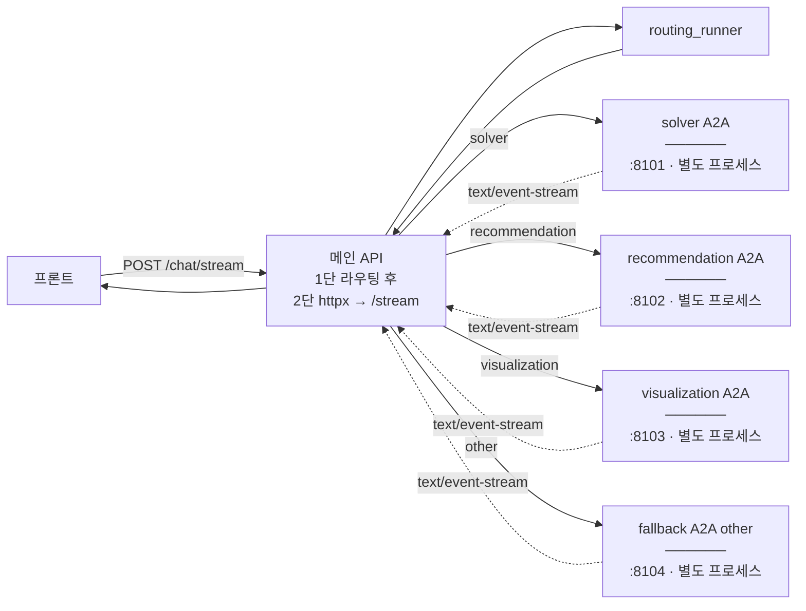

## A2A — route별 원격 서비스

**한 줄:**  
메인 API는 **먼저 라우팅만** 돌리고, 나머지 실제 풀이·추천·시각화·안내는 **route마다 따로 떠 있는 A2A ASGI 앱**이 처리합니다. 프론트는 여전히 **`POST /chat/stream` 한 번**만 치면 되고, 두 번째 구간은 서버 안에서 **같은 형식의 SSE**로 이어 붙습니다.

- 이 문서: **밖** — URL, 프로세스, `/stream` 브릿지  
- [agent_workflow.md](agent_workflow.md): **안** — 노드·state  
- [mcp.md](mcp.md): 추천 시 **MCP 검색**  
- 실행: [실행가이드.md](실행가이드.md)

---

### 프로세스가 2단인 이유 (한눈에)



**한 요청 기준으로는** 위 네 A2A 박스 중 **하나의 포트로만** 실제 연결이 열립니다. 네 박스는 로컬/운영에서 **동시에 떠 있는 네 개의 uvicorn 프로세스**를 뜻합니다.

1. **1단 (`/chat/stream`):** `execute_routing_stream`로 `routing_agent`만 돌려 `current_route`를 얻고, 그동안 나오는 이벤트는 그대로 프론트에 넘김.  
2. **2단:** `state["current_route"]`에 따라 [`_route_service_url`](../api/app.py)로 **해당 route의 A2A `POST /stream`**을 연다. 예: 추천이면 `http://localhost:8102/stream`.

메인 API에서 쓰는 **베이스 URL**은 [`config/properties.py`](../config/properties.py)의 `SOLVER_A2A_URL`, `RECOMMENDATION_A2A_URL`, `VISUALIZATION_A2A_URL`, `FALLBACK_A2A_URL` 이고, 코드에서 `/stream`을 붙입니다.

```python
# 발췌: api/app.py
def _route_service_url(route: str) -> str:
    base_urls = {
        "solver": settings.SOLVER_A2A_URL,
        "recommendation": settings.RECOMMENDATION_A2A_URL,
        "visualization": settings.VISUALIZATION_A2A_URL,
        "other": settings.FALLBACK_A2A_URL,
    }
    return f"{base_urls[route].rstrip('/')}/stream"
```

배포 시 **메인 API와 각 route 프로세스가 서로 URL로 보이게** 네트워크·포트·환경변수를 맞추면 됩니다.

---

### route A2A 앱 안에서 일어나는 일

핵심은 [`services.py`](../a2a_remote_routes/services.py)의 `build_route_app`입니다.

| 단계 | 코드 | 설명 |
|------|------|------|
| 에이전트·러너 | [`route_runner.py`](../smart_learning_agent/runner/route_runner.py) `get_*` | route 전용 워크플로 |
| A2A ASGI | `to_a2a(..., agent_card=...)` | discovery·RPC |
| 스트림 브릿지 | `POST /stream` | multipart → ADK 실행 → SSE |
| 헬스 | `GET /health` | 프로브 |

`build_route_app` 발췌:

```python
# 발췌: a2a_remote_routes/services.py
def build_route_app(route: str, host: str = "localhost", port: int = 0) -> Any:
    agent = get_route_agent(route)
    agent_card = _build_agent_card(route, host, port, agent)
    app = to_a2a(
        agent,
        host=host,
        port=port,
        agent_card=agent_card,
        runner=get_route_runner(route),
    )
    # ... async def stream(request): ... prepare_route_content / execute_route_stream ...
    app.add_route("/stream", stream, methods=["POST"])
    app.add_route("/health", health, methods=["GET"])
    return app
```

`stream` 안에서는 **`prepare_route_content` → `execute_route_stream` → `iter_frontend_events`** 로 프론트 계약 이벤트를 만듭니다. 변환: [`frontend_events.py`](../smart_learning_agent/streaming/frontend_events.py).

```python
# 발췌: services.py — stream 핸들러 내부
content = await prepare_route_content(
    route=route,
    session_id=session_id,
    user_id=USER_ID,
    query=query,
    state=state,
    image_bytes=image_bytes,
    image_mime_type=image_mime_type,
)
events = execute_route_stream(route, session_id, USER_ID, content)
async for frontend_event in iter_frontend_events(events, current_state):
    yield _sse_data(frontend_event)
```

---

### 앱 인스턴스·포트 (기본)

[`services.py`](../a2a_remote_routes/services.py)에서 빌더와 미리 만들어 둔 앱:

```python
def build_solver_app() -> Any:
    return build_route_app("solver", port=8101)

def build_recommendation_app() -> Any:
    return build_route_app("recommendation", port=8102)

solver_app = build_solver_app()
recommendation_app = build_recommendation_app()
# visualization 8103, fallback_app(other) 8104
```

uvicorn 예: [실행가이드.md](실행가이드.md).

---

### `POST /stream` 멀티파트

| 필드 | 설명 |
|------|------|
| `query` | 질문 텍스트 |
| `session_id` | 없으면 서버가 UUID |
| `state` | JSON 문자열 dict |
| `image` | 선택 |

---

### 서비스 이름 ↔ `route` 키

| 의미 | `build_route_app` 첫 인자 |
|------|---------------------------|
| solver | `solver` |
| recommendation | `recommendation` |
| visualization | `visualization` |
| 범위 밖 안내 | `other` |

---

### 요약 타임라인

```text
프론트 POST /chat/stream
  → 메인 API: 라우팅 스트림 (workflow_runner / routing_runner)
  → current_route
  → httpx POST {*_A2A_URL}/stream
  → route ASGI: route_runner.execute_route_stream
  → frontend_events SSE
  → 프론트 (state / chunk / curation / tracer / done …)
```
