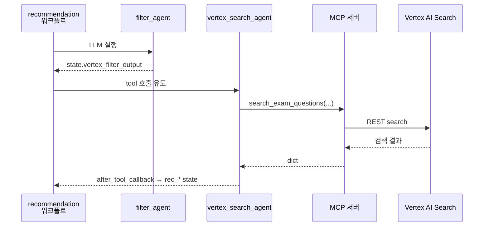

## MCP — Vertex AI Search를 tool로 쓰는 부분

**한 줄:** 추천(recommendation) 경로에서만, **연도·유형 같은 메타 필터는 LLM**이 만들고, **인덱스에 대한 실제 검색 호출은 MCP 서버의 `search_exam_questions`** 한 번으로 처리합니다. 메인 API ↔ MCP는 HTTP(`streamable-http`)입니다.

관련 문서: [agent_workflow.md](agent_workflow.md) (노드 순서), [실행가이드.md](실행가이드.md) (기동 명령).

---

### 전체가 이렇게 붙어 있어요



- ADK 프로세스와 **MCP 프로세스는 별도**입니다. 추천 요청이 올 때 MCP가 안 떠 있으면 연결 실패가 납니다.

---

### 프로세스를 단계로 쓰면

1. 사용자 질문이 라우팅을 거쳐 **recommendation route**로 들어감 ([A2A](a2a.md) + [agent_workflow](agent_workflow.md)).
2. [`filter_agent.py`](../smart_learning_agent/llm_agents/recommendation/filter_agent.py)가 `VertexFilterOutput` 스키마로 필터만 채워 `state["vertex_filter_output"]`에 둠 (MCP 안 탐).
3. [`vertex_search_agent.py`](../smart_learning_agent/llm_agents/recommendation/vertex_search_agent.py)가 Gemini에게 “반드시 `search_exam_questions` 한 번 호출”을 지시하고, 실제 호출은 ADK `McpToolset`이 MCP로 보냄.
4. [`server.py`](../mcp_server/vertexai_search/server.py)의 `search_exam_questions`가 [`search.py`](../mcp_server/vertexai_search/search.py)를 통해 Discovery Engine에 검색.
5. [`vertex_search_callback.py`](../smart_learning_agent/callbacks/vertex_search_callback.py)의 `save_vertex_search_result`가 응답을 파싱해 `rec_search_results`, `rec_query`, `rec_subject` 같은 키로 state를 맞춤.
6. 그 다음 노드(`curator_*`, `question_refine` 등)가 카드 데이터를 만듦.

---

### 앱(ADK) 쪽 — 읽을 파일

| 역할 | 파일 |
|------|------|
| 메타 필터 (LLM) | [`filter_agent.py`](../smart_learning_agent/llm_agents/recommendation/filter_agent.py) |
| MCP 검색 에이전트 | [`vertex_search_agent.py`](../smart_learning_agent/llm_agents/recommendation/vertex_search_agent.py) |
| tool → state 정규화 | [`vertex_search_callback.py`](../smart_learning_agent/callbacks/vertex_search_callback.py) |

**설정:** MCP 엔드포인트 URL은 [`config/properties.py`](../config/properties.py)의 `VERTEXAI_SEARCH_MCP_URL` (기본 `http://127.0.0.1:8200/mcp`). 서버 포트를 바꾸면 여기도 맞출 것.

`vertex_search_agent`에서 연결을 만드는 부분은 실제로 이렇게 되어 있습니다.

```python
# 발췌: smart_learning_agent/llm_agents/recommendation/vertex_search_agent.py
return McpToolset(
    connection_params=StreamableHTTPConnectionParams(
        url=settings.VERTEXAI_SEARCH_MCP_URL,
        timeout=_MCP_TIMEOUT_SECONDS,
    ),
    tool_filter=[_SEARCH_TOOL_NAME],  # "search_exam_questions"
)
```

에이전트 정의에는 `after_tool_callback=save_vertex_search_result`가 붙어 있어, MCP 응답 직후 state가 갱신됩니다. 전체는 [`vertex_search_agent.py`](../smart_learning_agent/llm_agents/recommendation/vertex_search_agent.py) 참고.

`filter_agent`는 MCP 없이 스키마만 박습니다.

```python
# 발췌: smart_learning_agent/llm_agents/recommendation/filter_agent.py
filter_agent = Agent(
    name="filter_agent",
    ...
    output_schema=VertexFilterOutput,
    output_key="vertex_filter_output",
    ...
)
```

콜백 쪽은 MCP 응답 형식(`structuredContent` / `content[].text` JSON 등)을 흡수합니다. 파싱 진입점은 [`_parse_mcp_response`](../smart_learning_agent/callbacks/vertex_search_callback.py).

---

### MCP 서버 — tool 정의 위치

`search_exam_questions`는 [`server.py`](../mcp_server/vertexai_search/server.py)에서 등록하며, 구현은 [`search.py`](../mcp_server/vertexai_search/search.py)의 Discovery Engine 호출·파싱 로직을 사용합니다. 추천 그래프에서는 이 tool만 호출합니다.

서버에서 tool 시그니처의 핵심은 아래와 같습니다 (`search_query` + 연·회차·유형 필터 + `page_size`).

```python
# 발췌: mcp_server/vertexai_search/server.py
@mcp.tool()
def search_exam_questions(
    search_query: str,
    years: list[int] | None = None,
    rounds: list[int] | None = None,
    question_types: list[str] | None = None,
    year_min: int | None = None,
    year_max: int | None = None,
    question_numbers: list[int] | None = None,
    page_size: int = 3,
    ...
) -> dict[str, Any]:
    return search_exam_questions_impl(...)
```

기동: 모듈 직접 실행 시 항상 `streamable-http`이며, 바인드는 `VERTEXAI_SEARCH_MCP_URL`과 동일해야 ADK `StreamableHTTPConnectionParams`와 짝이 맞습니다. 예시는 [`mcp_server/vertexai_search/README.md`](../mcp_server/vertexai_search/README.md).

---

### state 키만 빠르게 (추천 검색 직후)

| state 키 | 의미 (대략) |
|-----------|-------------|
| `vertex_filter_output` | LLM이 만든 메타 필터 |
| `rec_search_results` | MCP에서 온 문제 리스트 |
| `rec_query` | 실제 검색에 쓴 문장 |
| `rec_subject` | UI용 과목 라벨 (`전체` 등) |

---

### 정리: 데이터가 흐르는 한 줄 그래프

```text
rewritten_query + vertex_filter_output
    → vertex_search_agent
    → MCP search_exam_questions
    → save_vertex_search_result
    → rec_* 키들
    → curator / refine / problem_cards …
```
